# quarkus 프로젝트 시작! (학번 : 20250620 이름 : 유유솔)
매 주 수업 내용을 정리하자.

## 2, 3주차 수업 내용
실습 1 : 쿼크스 환경 구축 및 준비 완료
실습 2 : HTML 기본 및 LOL 메인 화면 개발 완료

 

## 4주차 수업 내용
1. 부트스트랩 5 이해 및 활용하기 (기본 레이아웃)
2. 외부 링크 활용하기
    - `<a href="">`
    - 실습 : 링크 추가해가며 적용
    - target="_blank" (새 창으로 열기)
3. 이미지 삽입 방법 알기
    - ``
    - 로컬로 이미지 로딩하기 
        - 이미지 폴더 생성
        - 상대경로, 절대경로 알아보기 
        - 실습 : 사일러스 수정
4. 콘솔창(F12, 개발자 모드) 로 코드 해석하기
5. 디자인&스타일의 우선 순위 배우기
    - 인라인 스타일보다도 부트스트랩 스타일 활용하기
6. 네비게이션 바 수정
    - 드랍다운, 서치창 등 부트스트랩의 코드로 실습 파일 편집하기 
    - 디자인 배경 DARK로 수정하기 
    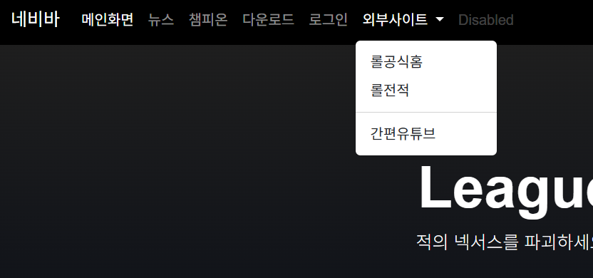
7. 챔피언 카드 추가하기, 그리드 수정
    - `
`
    - 실습 : 열 너비 자동 지정 
    
8. 서브 페이지 추가하기 
    - 모달창 구현하기(챔피언 세부 정보 출력)
    - 실습 : Aatrox 챔피언 
    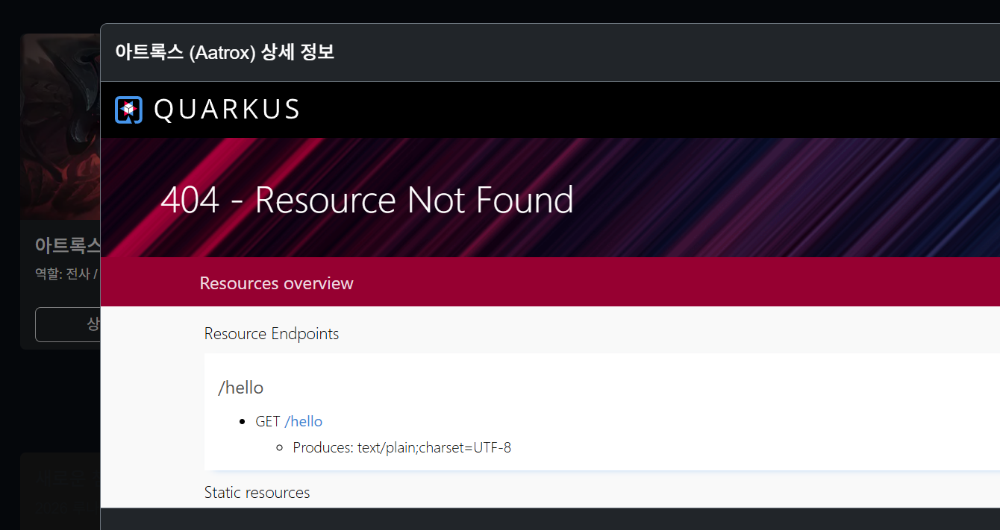
    - 이후 페이지를 완성해나갈 예정 

## 5주차 수업 내용
1. 카드-모달창 구현하기 
    - Aatrox.html을 삽입하여 상세 정보를 확인할 수 있게끔 함 
    - Aatrox라는 캐릭터의 그림 위치를 수정
        - Modals기준 경로로 상대 경로를 수정 및 추가(../)
        - (../)는 '현재 폴더에서 한 단계 위로 이동'이라는 뜻
    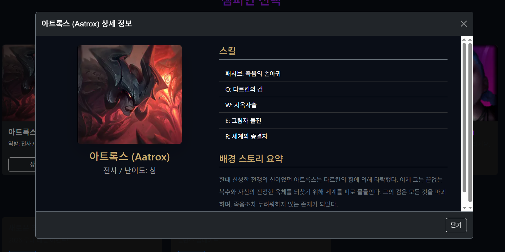
2. 서브 페이지 추가하기 
    - main_page_sub 폴더를 생성하여 서브 페이지의 추가 기반을 다짐
    - '다운로드' 서브 페이지 구축
        - 용도 : 파일 다운로드 및 설치 상세 
        - index.html 네비게이션 바의 '다운로드'에 해당되는 href를 `<a class="nav-link" href="main_page_sub/download.html">다운로드</a>`로 수정함으로써 다운로드 서브 페이지 html을 연결 
3. 서브 페이지 구현하기 
    - 템플릿 레이아웃 코드 재사용(네비게이션 코드(네비바)까지는 동일)
    - 빈 서브 페이지 구현 구상 
        - tip: 참고하고자 하는 웹사이트에서 F12 개발자 모드를 통해 소스 코드&화면 구성을 분석하고 비슷하게 구현하면 된다. 
        - 화면 구성 : 네비바/배너/권장 시스템 사양 안내 표 
    - 본격적으로 download.html을 수정 
        - 히어로 배너 코드 추가 
            - 배경 이미지 삽입 
            - css 폴더 생성, download.css파일 이용 
                - download.html의 기존 style태그 삭제
                - `<link rel="stylesheet" href="../css/download.css">`를 download.html의 style란에 삽입 -> css파일을 download.html에 연결 
            - download.css 파일 살피기 
                - 세부 속성들로 컬러 수정 익히기 
                - 특정 영역에 적용됨을 알기 (ex: .hero 등)
        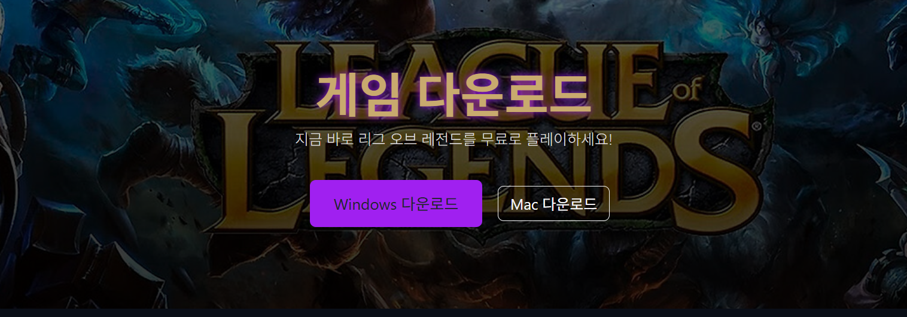
        - 표 추가 (권장 시스템 사양 안내)
            - download_table.html 열람 후 이용
            - 코드 전체 추가 후 표 구조 파악
                - `<tr>`은 행, `<td>`는 내부 셀 
        

## 6주차 수업 내용
1. 자바스크립트 구조 파악&외부 연결 링크를 로컬로 전환
    - js 폴더 생성 
    - `` 와 같이 연결되어있던 링크를 ``와 같이 js폴더를 만들어 내부 로컬에서 연동되도록 함 
    - 내부 스크립트 입력 
        - 메인 페이지 새로고침 시 '로딩 완료' 메시지가 뜨게 하고자 함
        - Html 파일 내에서 직접 js 삽입(index.html에 삽입)
        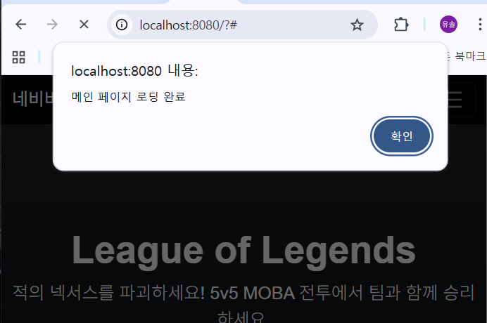
    - 인라인 방식 삽입 
        - 메인 페이지의 무료플레이 버튼 클릭 시 '즐거운 플레이 되세요'가 뜨게 하고자 함
        - `<a href="#" class="btn btn-primary btn-lg" onclick="alert('즐거운 플레이 되세요')">무료 플레이</a>`와 같은 형식의 인라인 삽입
        
2. F12 개발자 모드를 이용한 js 로딩 확인
    - JS 출력 및 에러 확인 
    - 콘솔 출력 확인 
    - 자바스크립트 기본 문법
        - 스코프 : 변수가 살 수 있는 범위
        - 재선언 : 같은 이름으로 `변수`를 또 만드는 것
        - 재할당 : 기존 변수의 `값`만 바꾸는 것 
        - 구분
            - var : 함수 스코프, {}밖에서의 접근 가능, 재선언 가능, 재할당 가능 
            - let : 블록 스코프, {}밖에서의 접근 불가능, 재선언 불가능, 재할당 가능
            - const : 블록 스코프, {}밖에서의 접근 불가능, 재선언 불가능, 재할당 불가능
        - test.js를 이용한 기본 문법 익힘 과정 진행 
            - SyntaxError 에러 : 실행 전(파싱 단계) 발생, 예시-let y 중복선언
            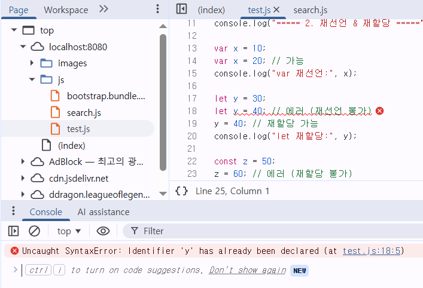
            - TypeError : 실행 중(런타임) 발생, 예시-const z 재할당 시도
            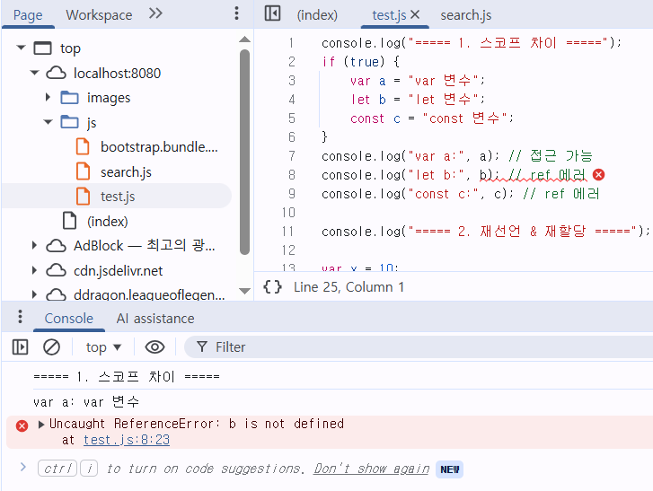
            - ReferenceError 에러 : 실행 후(런타임) 발생, 예시-블록 밖에서 b접근
            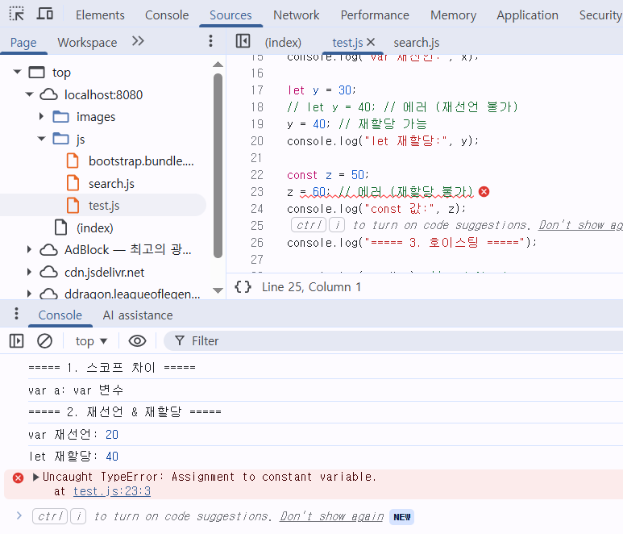
            - 에러 발생 시 해당 줄을 주석처리해야 후행 코드 확인 가능 (사유: 에러 발생 시점에서 실행이 멈추기 때문)
        - 호이스팅 : 변수/함수 선언이 코드 실행 전에 맨 위로 끌어올려지는 것
            - var : 선언만 끌어올려짐 → 선언 전에 접근해도 undefined 반환
            - let/const : 선언은 끌어올려지지만 초기화는 안 됨
                -> 선언 전에 접근하면 ReferenceError 발생 (이 구간을 TDZ, Temporal Dead Zone이라고 부름)
3. 자바스크립트 기능 구현 
    - 검색 기능 구현
        - 의도 : 검색 버튼 클릭 시 구글 외부 검색으로 연결
        - 구조
            - form 태그 : 웹사이트에서 이벤트를 구현하는 데 주로 사용
            - form 안에서 input(식별자: searchInput)과 button으로 구분
            - form의 현재 id : searchForm
        - 동작 원리
            - addEventListener : submit 이벤트 등록
            - getElementById : 키워드 인식 및 검색 수행
            - encodeURIComponent : 검색어를 URL 파라미터로 변환
            - 새 창(target=_blank)으로 구글 검색 결과 출력
        - search.js 코드를 이용
        - 확인 방법 : F12 개발자 모드 → 소스 탭
        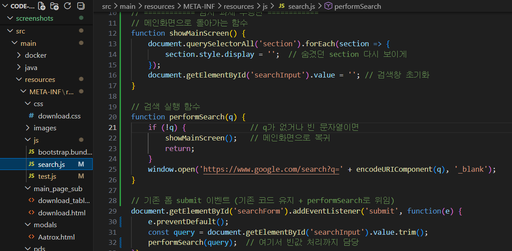
4. DOM(Document Object Model) 이란?
    - JS가 HTML 태그에 접근/변경할 수 있게 해주는 인터페이스
    - HTML을 트리 구조(DOM)로 변환하여 관리
    - 해당 프로젝트 활용 예시 :
        document.getElementById("searchInput") → input 태그 접근
        document.getElementById("searchForm")  → form 태그 접근

## 7주차 수업 내용

1. css파일의 분리 관리
    - 기존 index.html 파일에 있던 style 소스코드를 분리해 css폴더로 분리
    - main.css 파일 생성 후 디자인 모두 옮김 
    - 기존의 코드 자리에는 .css를 연동시킴 
    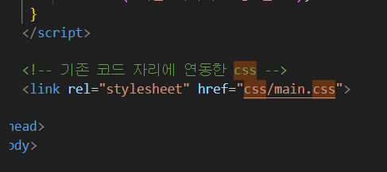
2. 웹사이트 내부 검색 기능
    - 의도: 새로운 탭이 아닌 웹사이트 내부에서의 검색 결과가 출력되도록 하고자 함
    - 기존의 search.js 주석처리 후 하단 추가 작성(index.html에 대한 수정)
    - 결과 : 검색창에 챔피언 이름 검색 시 창 유지 및 검색결과 출력  
    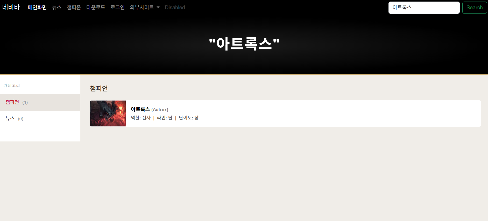
3. 마무리&과제
    - 데이터 정의 추가 : 티모, 렉사이, 야스오 등 3개의 챔피언 추가 
        - index.html 수정 -> 메인 페이지에서의 챔피온 데이터 게시 
    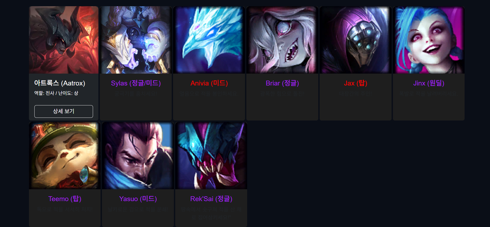
        - search.js의 챔피언 데이터 배열에 챔피언 추가
    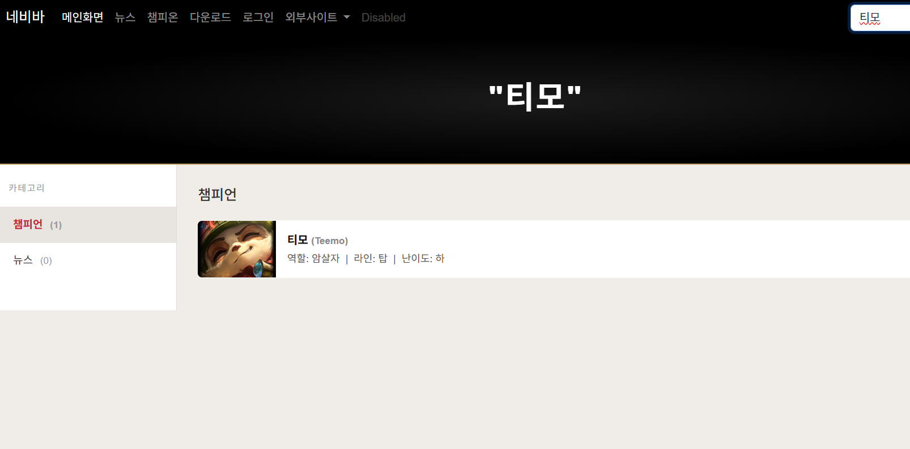
    - 검색어 기능 추가 : showMainScreen()함수 추가, 조건에 맞추어 기능 구현 

## 8주차 수업 내용 - 중간고사 

## 9주차 수업 내용

1. 자바스크립트 자료 구조 파악하기
    1) 일반 배열 및 객체 배열 
        - 객체 배열 : 키(key)를 통해 데이터의 의미를 즉시 파악 
            - 추천 상황 : 데이터베이스 검색 결과, 사용자 목록, 게시판 글 리스트 등
        - 일반 배열 : 불분명함. 인덱스(순서)가 무엇을 의미하는지 미리 약속해야 함. 
            - 추천 상황 : 단순 선택지 목록, 태그 리스트, 점수 목록, 좌표 값 등 
    2) test2.js 파일을 통한 배열 학습 테스트
        - F12모드를 통한 콘솔 확인
        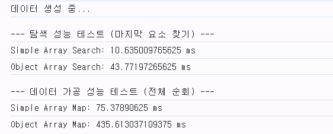
2. 자바스크립트 기능 (다크<->라이트 모드 전환)
    1) index.html 수정 (HTML 역할 - 구조, 뼈대)
        - 네비바 기존 코드 수정
        - `` 로고 배치
        - `<button>` 토글 버튼 
        - `onclick="toggleTheme()"` 로 js 함수 연결 
        - `<script src>` 태그로 js 파일 불러옴 
    2) main.css 수정 (CSS 역할 - 디자인, 스타일)
        - 토글 버튼 디자인 설정
        - `.light-mode` 정의
        - navbar card 색상 
        - !important 강제 적용 
    3) toggle.js 파일 추가 (동작, 로직)
        - toggleTheme() 함수 
        - `body.classList.toggle('light-mode')`핵심
        - CSS 일괄 전환 유발 
    4) 종합 : index.html에 main.css와 toggle.js를 연동 
    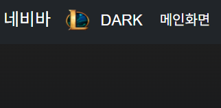
3. 자바 소스코드 살펴보기 
    - java/org/acme 폴더 이용 
    - 어노테이션 3개가 각각 다른 계층에서 역할을 나눠 갖는 구조
    - 어노테이션 3개가 조합되어 하나의 엔드포인트 완성  
        - @Path : 클래스 레벨, 경로 등록 (URL 경로를 클래스에 매핑, ex. @Path("/hello")면 `http://localhost:8080/hello`, 기본 경로는 /hello로 공유되는 것) 
        - @GET : 메서드 레벨, HTTP GET 메서드 구분
        - @Produces : 응답 형식 Content-Type 지정 (ex. text/plain) 
    - 자바 vs 자바스크립트, 둘은 명확한 차이가 있다 
        - Java : 엄격하고 명시적
        - JavaScript : 유연하고 동적 
    - quarkus 내부 동작과정 
        - 진입점은 빌드 타임에 자동 생성
        - QuarkusMain.main() -> ArC(CDI 컨테이너)
        - 매핑 및 설정 로드 후 서버 실행
4. 데이터베이스 연동 
    - MYSQL 설치 및 연동
    - DB 및 테이블 추가
    - 챔피온 정보 불러오기 
    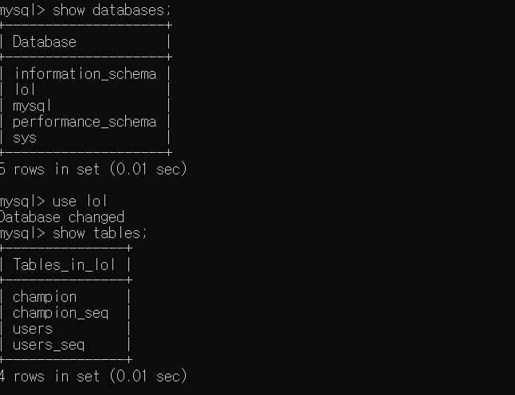
5. 과제 
    1) 챔피온 검색 결과 모달창 띄우기
        - modalId 속성
        - search.js 수정 
            - 1) modal 아이디를 객체 배열에 추가 
            - 2) `data-bs-toggle="modal"`, `data-bs-target` 속성&클릭 이벤트 추가 
        - HTML 수정 
            - modal을 section 밖으로 꺼냄 
        - 현재는 아트록스의 모달창만 기능 중이나, 향후 주차에서 모달창을 추가해 갈 예정 
        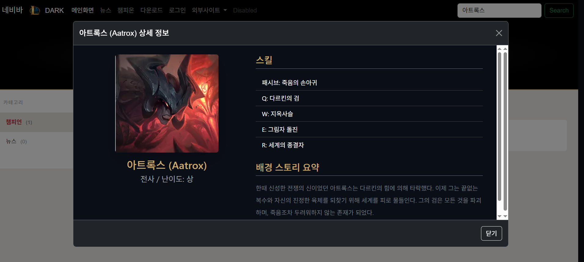
    2) 자바스크립트 호출 방식 변경하기 
        - 기존 토글 함수를 인라인 → 리스너 방식으로 변경
        - 모든 페이지에 동일 적용 
        - 1) toggle.js 수정 : 파일 안에 리스너 추가 
        - 2) index.html 수정 : 파일에서 onclick 제거
        - 3) download.html 수정
            - 동일한 버튼 추가
            - toggle.js 연결 추가
        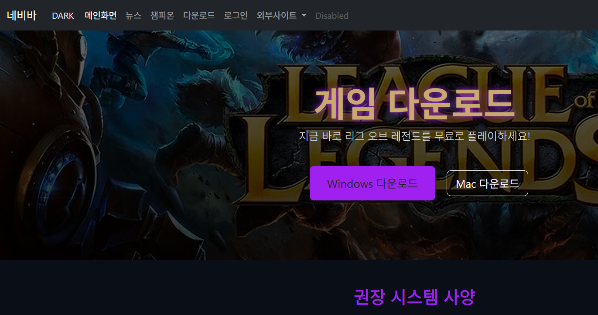 

## 10주차 수업 내용 

1. 데이터베이스 연동 
    1) 프로젝트 내부 의존성 추가 (pom.xml 파일 수정)
    2) 애플리케이션 db 설정 추가 (application.properties 파일 수정)
    3) 프로젝트 dev 보드를 통한 dv 확인 
    4) 데이터 저장을 위한 DB 내부 테이블 생성
        - Champion.java 파일 생성
        - DB 테이블과 Java 객체를 매핑하는 엔티티 클래스 작성
    5) 웹 서버 접근 API 추가하기
        - ChampionResource.java 파일 생성
        - @Path, @GET 등 어노테이션으로 챔피언 데이터 조회 API 추가
    6) 테이블 데이터 삽입하기 (DataSeeder.java 파일 작성)
    7) 개발자 보드에서 DB 확인 
    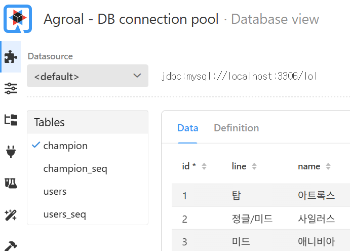 
    8) VS CODE 확장 모듈을 통한 DB 확인
        - localhost, id root 사용, 포트는 3306 사용 (필요하다면 3406으로 전환 예정)
    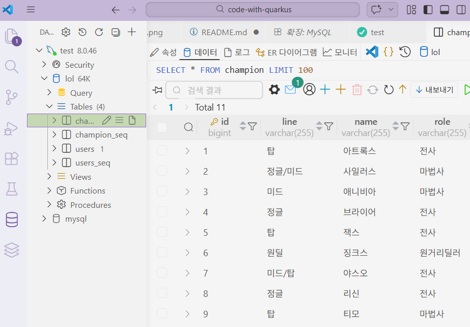 

    의존성 추가 -> DB 설정 -> 엔티티 -> API -> 데이터 삽입 -> 확인

2. 로그인 기능 만들기
    - 메인화면 네비바 -> 로그인 버튼 연결
        1) index.html 수정 -> 네비바 로그인 링크 수정 
        2) Quarkus /login 엔드포인트
            - login/AuthResource.java 수정 
            - 로그인 요청을 받고 로그인 html 페이지를 반환하기 위해 
    - 로그인 페이지 작성 
        1) 기존 html 폼을 유지하는 선에서 별도의 로그인 폼을 붙여넣음 (아이디/패스워드 폼 전송)
        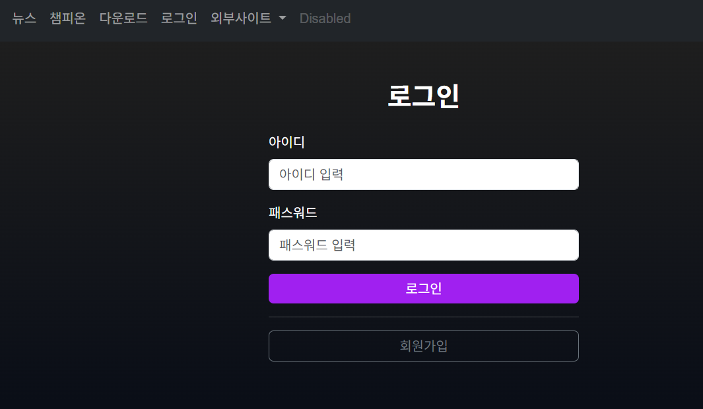 
        2) Quarkus /login_check 엔드포인트
            - AuthResource.java에 추가한다. DB체크 전 로그인 경로가 잡혀 있는지 임시 로그인으로 확인 
    - 로그인 후 페이지 (로그아웃 버튼)
        - login 폴더에 main_after_login.html 을 추가 
        - 기존 index.html 폼을 재활용하나, 기존 로그인 버튼을 제거하고 로그아웃 버튼을 추가한다. 
        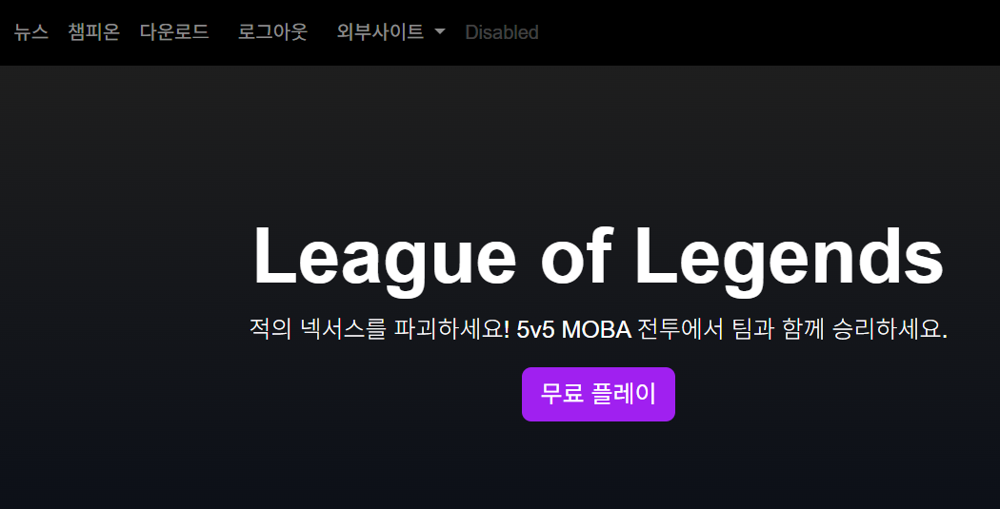 

        링크 -> 엔드포인트 -> 폼 -> 체크 -> 로그인 후 페이지

3. 데이터베이스 
    1) 사용자 테이블 생성
        - User.java 를 작성한다. (엔티티 작성)
        - username, password는 String 타입. 
    2) 임시 사용자 데이터 삽입 
        - DataSeeder.java에 추가한다. (guest 계정)
        -mysql 접속 후 lol db 확인, user 확인이 가능하다. 
        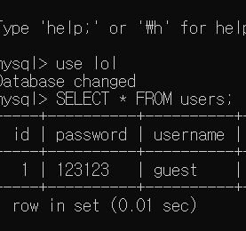

4. 과제 
    - 로그인 페이지의 다크/라이트 모드 구현 
        - login.html과 main_after_login.html을 수정
        - 버튼에서 onclick 제거 (인라인 -> 리스너 방식 통일)
    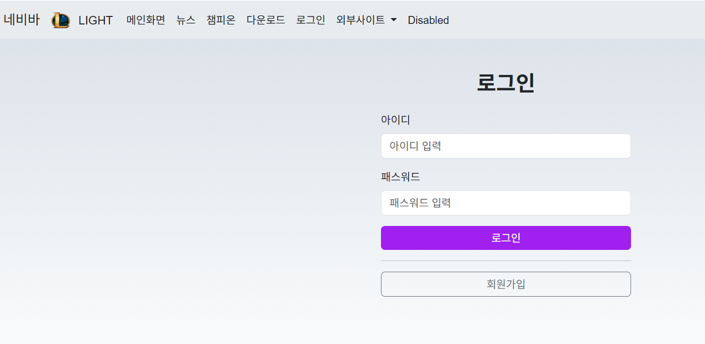 
    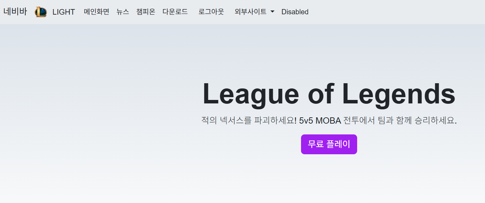 
    - 다운로드 페이지의 다크/라이트 모드 구현 
        - lndex.html의 main.css를 download.css에 덧씌움 
        - 이후 가독성이 좋지 않은 부분들을 별개로 download.css에서 세부 조정 
    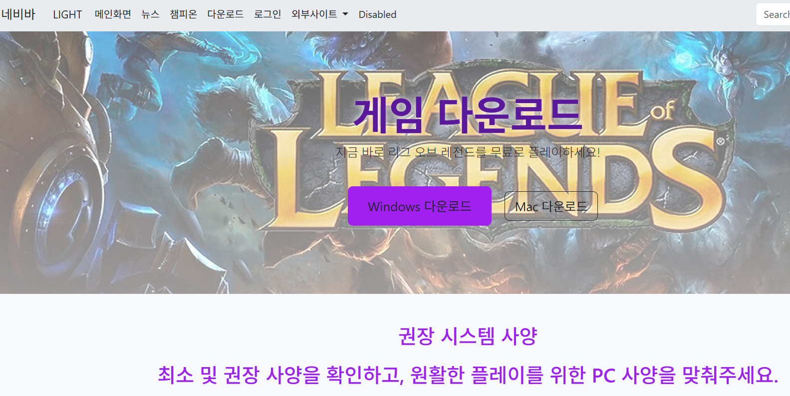 

## 11주차 수업 내용 
1. 로그인과 로그아웃 
    - 세션 활성화 설정 추가
        - Login 폴더에 SessionConfig.java 를 작성 
        - @inject -> 컨테이너가 Session 객체를 자동으로 주입
        - @Observes -> 애플리케이션 시작 이벤트를 감지해서 세션 설정 초기화  
    - 로그인 사용자 DB 체크 -> 인증 처리
        - /login_check를 완성한다
        - AuthResource.java를 수정한다 (DB조회로 인증 처리)
        - 동작 흐름
            1) username, password POST로 전송받음
            2) DB에서 username 조회
            3) password 일치 여부 확인
            4) 일치 → 세션에 로그인 정보 저장 → /after_login 이동 
               불일치 → 로그인 페이지로 다시 이동
    - 로그인 후 페이지 (세션 체크 필수)
        - /after_login 을 작성한다
        - AuthResource.java에 추가한다 
            - 세션이 있을 시 -> 로그인 후 HTML 반환
            - 세션이 없을 시 -> 로그인 페이지로 강제 이동 
        - 로그인 이후 세션 쿠키 확인하기
        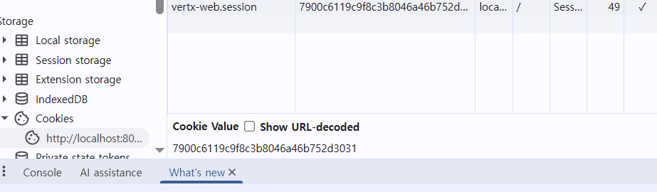
    -  /logout 로그아웃 엔드포인트 
        - 세션 초기화(로그아웃) 후 메인 페이지 이동
            - 서버의 login 사용자의 세션 데이터는 연결 해제됨
            - session.invalidate() 호출 -> 서버 세션 삭제 -> 메인 페이지 redirect
        

    설정 -> 인증 -> 세션체크 -> 로그아웃

2. 회원가입 기능 추가
    - 회원가입 버튼 추가 
        - login 폴더의 login.html을 수정 
        - 기존 로그인 버튼 아래에 자리할 수 있게끔 조정 
        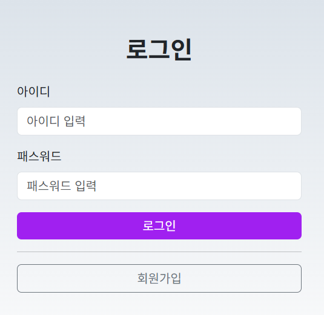
        - 회원 등록 /register 요청 (엔드포인트 등록 필요)
        - register 엔드포인트 등록 
            - loging 폴더의 AuthResource.java를 수정
            - dev-ui내의 엔드포인트 목록 확인
        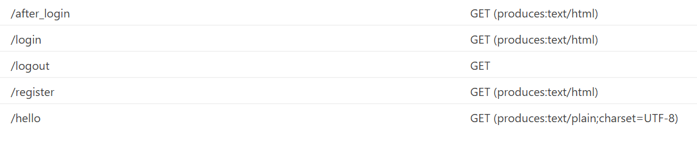
    - 회원가입 폼 작성
        - 회원가입 화면 작성하기 
            - login 폴더의 register.html을 수정한다. (기존 login.html 디자인 재활용)
            - 아이디, 패스워드, 패스워드 확인, 이메일, 연락처 화면 나오도록 
        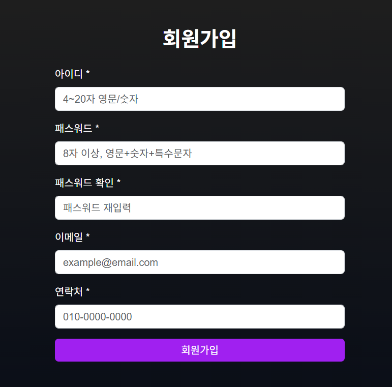
    - 회원 테이블 수정하기 
        - User.java를 수정한다. 컬럼을 추가한다. 
        - 이메일 중복 방지, 아이디로 조회, 이메일로 조회 할 수 있도록 
        
    - 입력값 유효성 검사(JS) -> 중복 아이디, 이메일 등
        - Js폴더에 input_check.js를 작성한다.
        -  동작 흐름
            1) 아이디 : 4~20자 영문 숫자
            2) 패스워드 : 8자 이상, 영문+숫자+특수문자
            3) 패스워드 일치 여부 확인
            4) 이메일 형식 확인
            5) 연락처 형식 확인 
            6) 전체 통과 시 확인 모달 출력 
        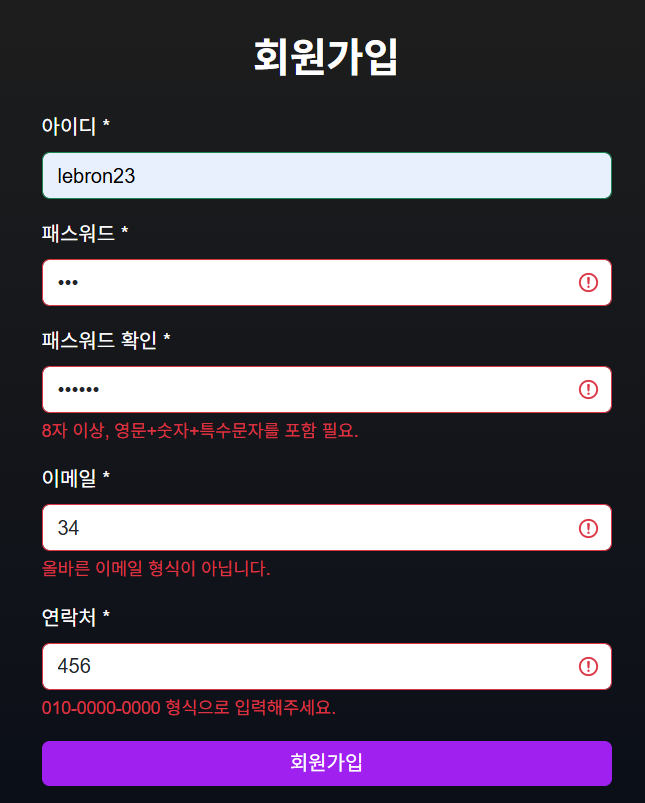
        

3. 암호화
    - SHA-256 해시, 모달창
        - JS폴더에  input_sha256.js을 작성

4. 과제 
    - 로그인 화면 입력값 체크 (회원가입과 같은 방식으로 유효성 검사를 진행할 수 있게끔 한다.)
        1) 회원가입 화면의 입력값 체크 
        2) Js폴더에 login.js를 생성하고 작성한다.  
            - 기존 input_check.js를 참고하여 재활용 
            - username을 usernameInput으로, password를 passwordInput으로 바꾸어 입력. 
            - 파라미터 개수를 맞추어 입력과 출력이 동일하도록 조정
        3) Login 폴더에 login.html도 수정한다. 
            - id로 usernameInput과 passwordInput을 추가. 
        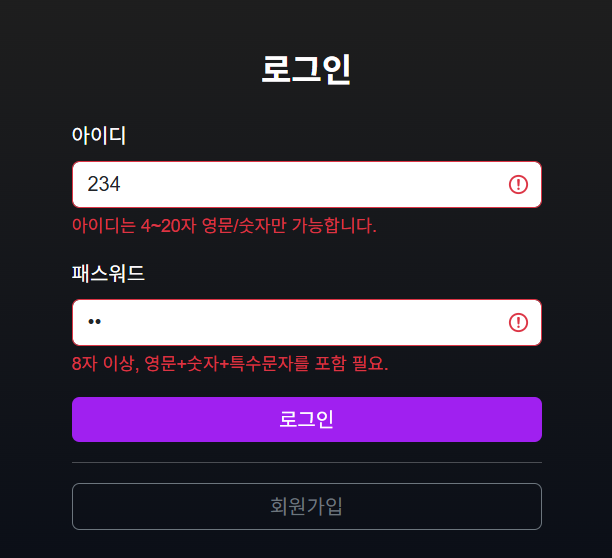

## 12주차 수업 내용
1. 암호화
    - 해시를 생성해 가입 확인 모달을 출력하게끔 함 
        1) input_sha256.js를 작성 
            - 패스워드 해시 암호화 후 확인 모달 출력 
        2) register.html에 추가 작성 
            - 가입 확인 모달이 출력되게끔 함 (박스가 띄워지도록)
        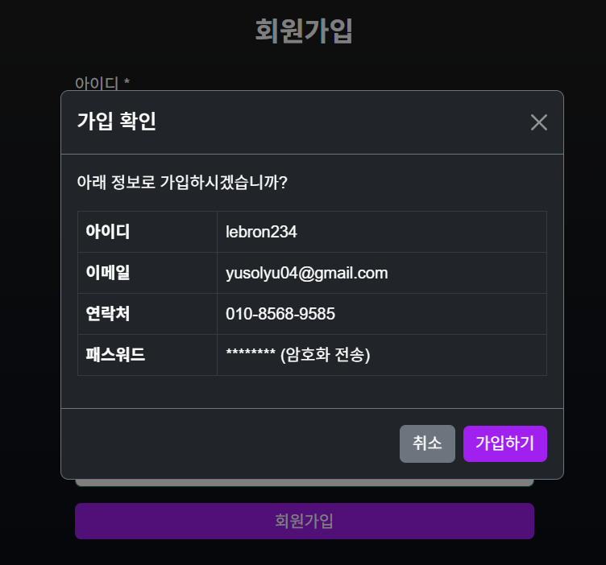
        3) 엔드포인트 
            - /register_check 엔드포인트 
            - AuthResource.java의 하단에 추가 작성
            - 아이디와 이메일을 중복 체크한 후 가입 완료 페이지로 이동할 수 있게끔 한다. 
            - 가입 완료 페이지로 연결된다. 
            - register_success.html도 작성, 기존 디자인 활용 
         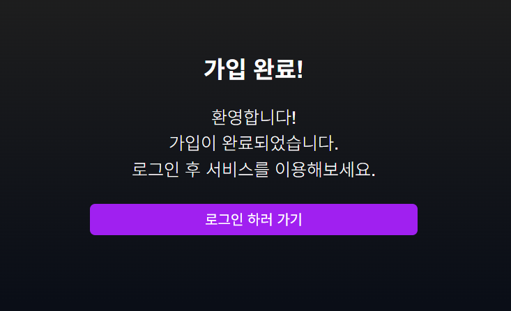
         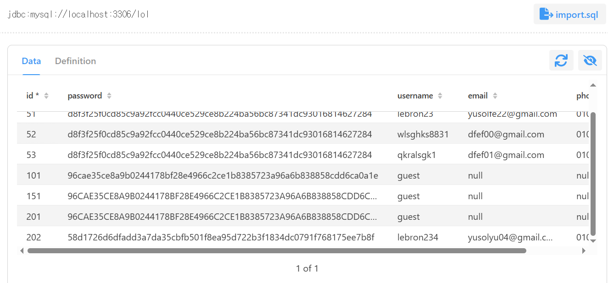
            - dev.ui에서 유저 정보를 확인할 수 있다. 
2. 로그인 - 암호화 체크 
    1) 로그인 페이지의 암호화 구현
        - login.js를 추가 및 수정
        - 정규식 검사 함수는 유지 
        - 로그인 시 비밀번호를 SHA-256으로 해시해서 서버에 전송하기 위한 코드
        - 네트워크로 평문 비밀번호가 아닌 해시값이 전달되도록 
        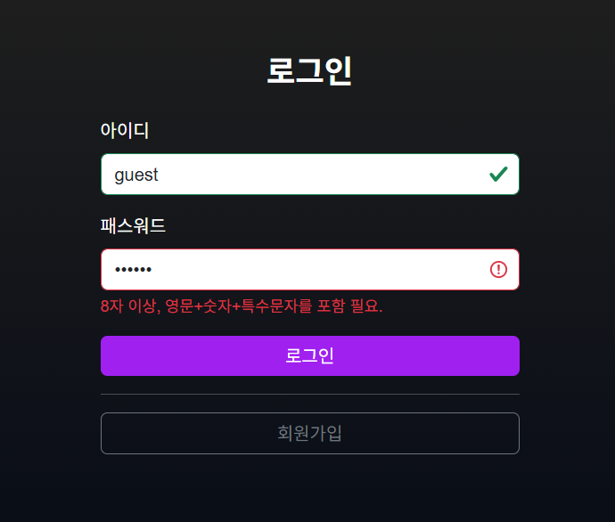
    2) guest 계정 패스워드 - 해시값으로 교체
        - 기존 123123이 아닌 다른 비밀번호로 해시값 생성
        - 교체 후 mysql에서 패스워드를 업데이트 
        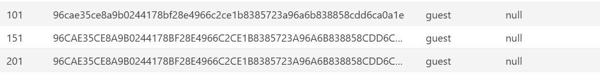
3. 세션 체크 
    - 로그인을 정상적으로 했고, 서버에서 세션도 정상 생성되었으나 메인화면으로 이동하면 로그아웃이 아닌 로그인 버튼이 표시되는 오류가 생김
    - 화면(프론트엔드)가 로그인 상태를 알 수 있도록 확인하는 '세션 체크'코드를 삽입 및 구현
    - AuthResource.java를 수정
        - 파일명을 Index.html → main_index.html로 변경
4. 프로필 페이지 
    - 네비바에 프로필 링크 추가 (main_after_login.html을 수정)
    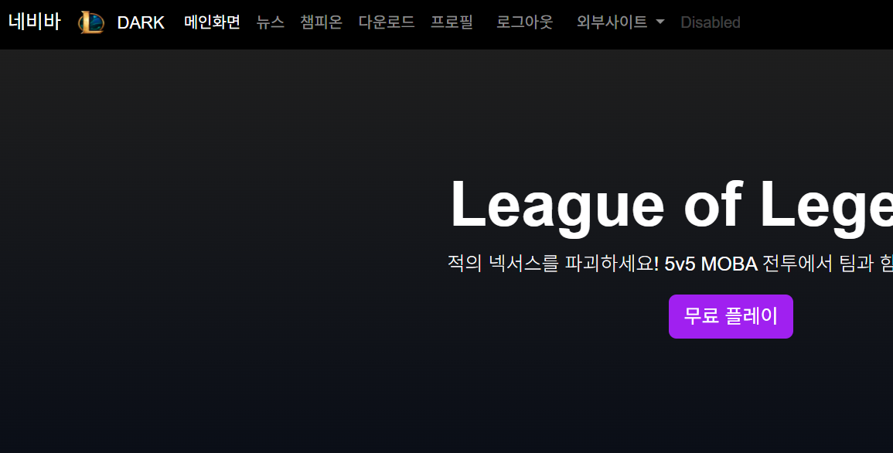
5. 과제
    - 세션 체크 없이 무조건적으로 로그인 html을 반환하는 AuthRessource.jaca의 loginPage()메서드를 수정 
    - 세션 체크 후 로그인 된 상태라면 after_login으로, 로그인이 되지 않은 상태라면 기존대로 로그인 페이지를 반환하도록 
    - 로그인된 사용자가 /login에 접근하면 차단, /after_login으로 보내기 
    - 중복 로그인, 세션 덮어쓰기 문제 해결 
