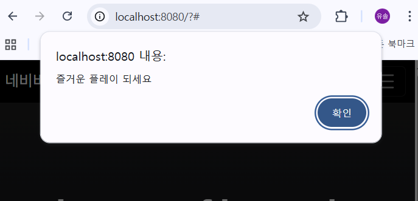
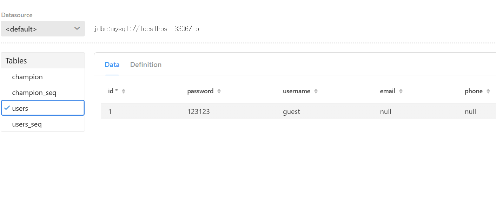
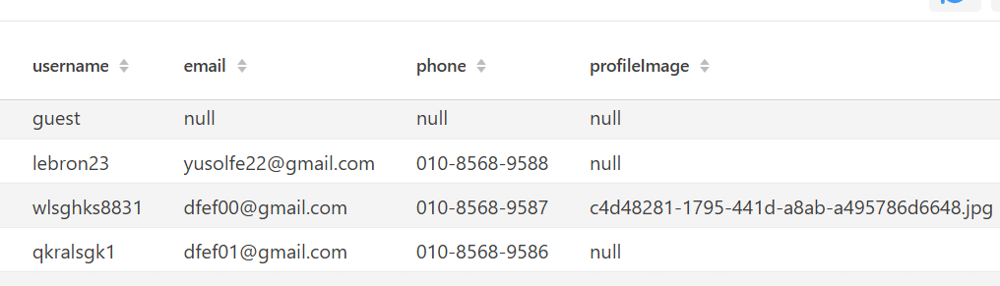
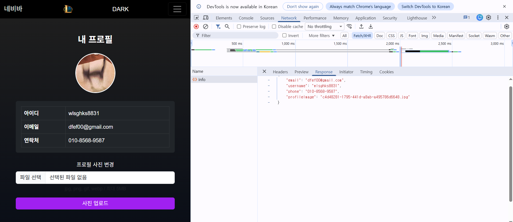
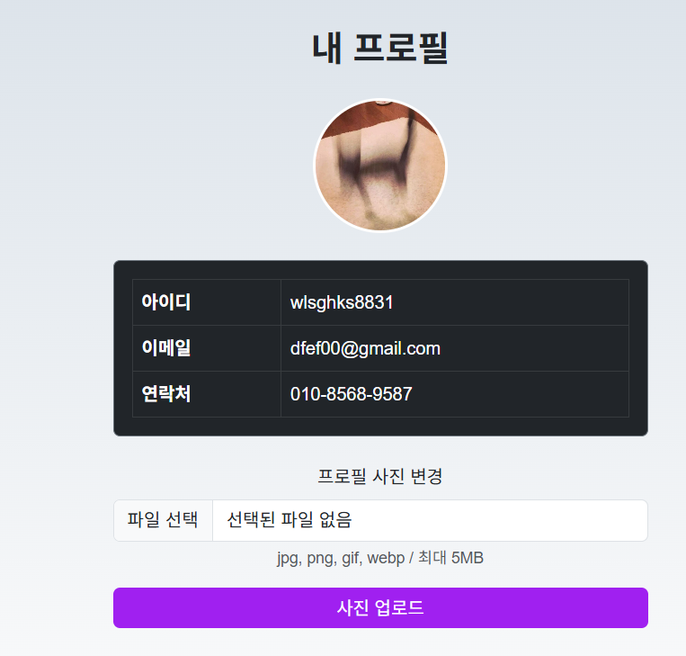
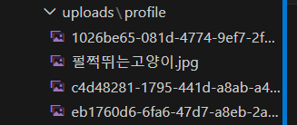
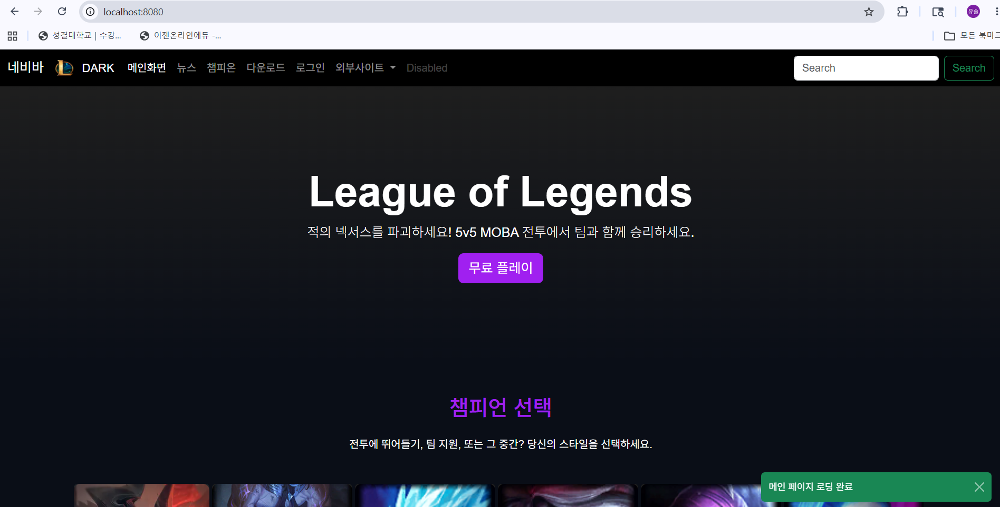
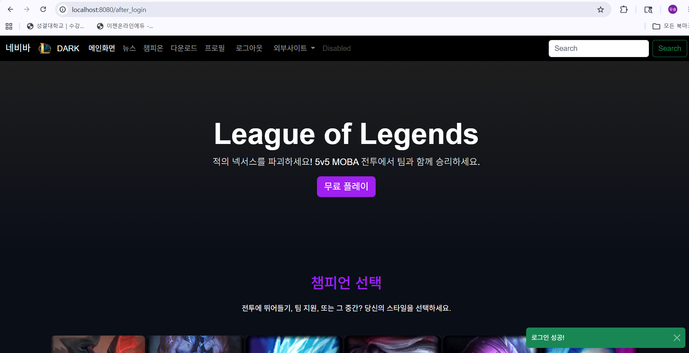
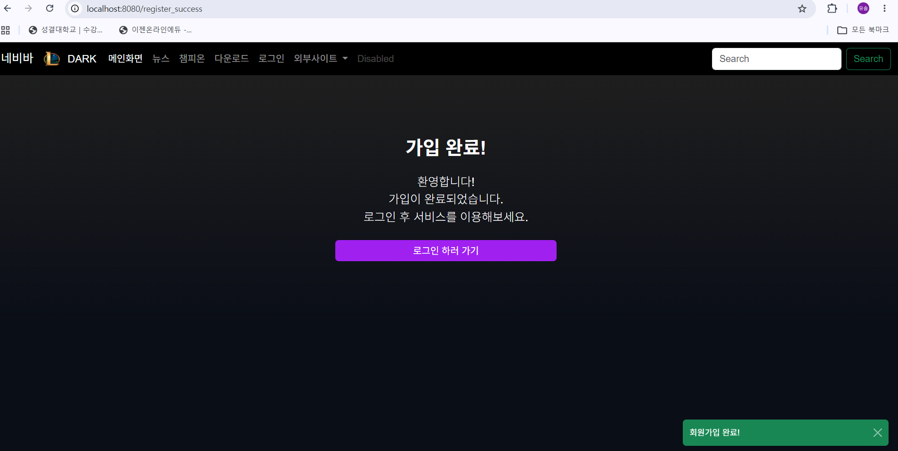
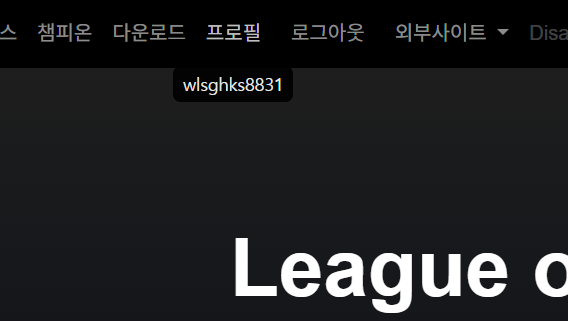

# quarkus 프로젝트 시작! (학번 : 20250620 이름 : 유유솔)
매 주 수업 내용을 정리하자.

## 2, 3주차 수업 내용
실습 1 : 쿼크스 환경 구축 및 준비 완료
실습 2 : HTML 기본 및 LOL 메인 화면 개발 완료

## 4주차 수업 내용
1. 부트스트랩 5 이해 및 활용하기 (기본 레이아웃)
2. 외부 링크 활용하기
    - `<a href="">`
    - 실습 : 링크 추가해가며 적용
    - target="_blank" (새 창으로 열기)
3. 이미지 삽입 방법 알기
    - ``
    - 로컬로 이미지 로딩하기 
        - 이미지 폴더 생성
        - 상대경로, 절대경로 알아보기 
        - 실습 : 사일러스 수정
4. 콘솔창(F12, 개발자 모드) 로 코드 해석하기
5. 디자인&스타일의 우선 순위 배우기
    - 인라인 스타일보다도 부트스트랩 스타일 활용하기
6. 네비게이션 바 수정
    - 드랍다운, 서치창 등 부트스트랩의 코드로 실습 파일 편집하기 
    - 디자인 배경 DARK로 수정하기 

    

7. 챔피언 카드 추가하기, 그리드 수정
    - `
`
    - 실습 : 열 너비 자동 지정 

    

8. 서브 페이지 추가하기 
    - 모달창 구현하기(챔피언 세부 정보 출력)
    - 실습 : Aatrox 챔피언 

    

    - 이후 페이지를 완성해나갈 예정 

## 5주차 수업 내용
1. 카드-모달창 구현하기 
    - Aatrox.html을 삽입하여 상세 정보를 확인할 수 있게끔 함 
    - Aatrox라는 캐릭터의 그림 위치를 수정
        - Modals기준 경로로 상대 경로를 수정 및 추가(../)
        - (../)는 '현재 폴더에서 한 단계 위로 이동'이라는 뜻

    

2. 서브 페이지 추가하기 
    - main_page_sub 폴더를 생성하여 서브 페이지의 추가 기반을 다짐
    - '다운로드' 서브 페이지 구축
        - 용도 : 파일 다운로드 및 설치 상세 
        - index.html 네비게이션 바의 '다운로드'에 해당되는 href를 `<a class="nav-link" href="main_page_sub/download.html">다운로드</a>`로 수정함으로써 다운로드 서브 페이지 html을 연결 
3. 서브 페이지 구현하기 
    - 템플릿 레이아웃 코드 재사용(네비게이션 코드(네비바)까지는 동일)
    - 빈 서브 페이지 구현 구상 
        - tip: 참고하고자 하는 웹사이트에서 F12 개발자 모드를 통해 소스 코드&화면 구성을 분석하고 비슷하게 구현하면 된다. 
        - 화면 구성 : 네비바/배너/권장 시스템 사양 안내 표 
    - 본격적으로 download.html을 수정 
        - 히어로 배너 코드 추가 
            - 배경 이미지 삽입 
            - css 폴더 생성, download.css파일 이용 
                - download.html의 기존 style태그 삭제
                - `<link rel="stylesheet" href="../css/download.css">`를 download.html의 style란에 삽입 -> css파일을 download.html에 연결 
            - download.css 파일 살피기 
                - 세부 속성들로 컬러 수정 익히기 
                - 특정 영역에 적용됨을 알기 (ex: .hero 등)

                

        - 표 추가 (권장 시스템 사양 안내)
            - download_table.html 열람 후 이용
            - 코드 전체 추가 후 표 구조 파악
                - `<tr>`은 행, `<td>`는 내부 셀 

            

## 6주차 수업 내용
1. 자바스크립트 구조 파악&외부 연결 링크를 로컬로 전환
    - js 폴더 생성 
    - `` 와 같이 연결되어있던 링크를 ``와 같이 js폴더를 만들어 내부 로컬에서 연동되도록 함 
    - 내부 스크립트 입력 
        - 메인 페이지 새로고침 시 '로딩 완료' 메시지가 뜨게 하고자 함
        - Html 파일 내에서 직접 js 삽입(index.html에 삽입)

        

    - 인라인 방식 삽입 
        - 메인 페이지의 무료플레이 버튼 클릭 시 '즐거운 플레이 되세요'가 뜨게 하고자 함
        - `<a href="#" class="btn btn-primary btn-lg" onclick="alert('즐거운 플레이 되세요')">무료 플레이</a>`와 같은 형식의 인라인 삽입

        

2. F12 개발자 모드를 이용한 js 로딩 확인
    - JS 출력 및 에러 확인 
    - 콘솔 출력 확인 
    - 자바스크립트 기본 문법
        - 스코프 : 변수가 살 수 있는 범위
        - 재선언 : 같은 이름으로 `변수`를 또 만드는 것
        - 재할당 : 기존 변수의 `값`만 바꾸는 것 
        - 구분
            - var : 함수 스코프, {}밖에서의 접근 가능, 재선언 가능, 재할당 가능 
            - let : 블록 스코프, {}밖에서의 접근 불가능, 재선언 불가능, 재할당 가능
            - const : 블록 스코프, {}밖에서의 접근 불가능, 재선언 불가능, 재할당 불가능
        - test.js를 이용한 기본 문법 익힘 과정 진행 
            - SyntaxError 에러 : 실행 전(파싱 단계) 발생, 예시-let y 중복선언

            

            - TypeError : 실행 중(런타임) 발생, 예시-const z 재할당 시도

            

            - ReferenceError 에러 : 실행 후(런타임) 발생, 예시-블록 밖에서 b접근

            

            - 에러 발생 시 해당 줄을 주석처리해야 후행 코드 확인 가능 (사유: 에러 발생 시점에서 실행이 멈추기 때문)
        - 호이스팅 : 변수/함수 선언이 코드 실행 전에 맨 위로 끌어올려지는 것
            - var : 선언만 끌어올려짐 -> 선언 전에 접근해도 undefined 반환
            - let/const : 선언은 끌어올려지지만 초기화는 안 됨
                -> 선언 전에 접근하면 ReferenceError 발생 (이 구간을 TDZ, Temporal Dead Zone이라고 부름)
3. 자바스크립트 기능 구현 
    - 검색 기능 구현
        - 의도 : 검색 버튼 클릭 시 구글 외부 검색으로 연결
        - 구조
            - form 태그 : 웹사이트에서 이벤트를 구현하는 데 주로 사용
            - form 안에서 input(식별자: searchInput)과 button으로 구분
            - form의 현재 id : searchForm
        - 동작 원리
            - addEventListener : submit 이벤트 등록
            - getElementById : 키워드 인식 및 검색 수행
            - encodeURIComponent : 검색어를 URL 파라미터로 변환
            - 새 창(target=_blank)으로 구글 검색 결과 출력
        - search.js 코드를 이용
        - 확인 방법 : F12 개발자 모드 -> 소스 탭

        

4. DOM(Document Object Model) 이란?
    - JS가 HTML 태그에 접근/변경할 수 있게 해주는 인터페이스
    - HTML을 트리 구조(DOM)로 변환하여 관리
    - 해당 프로젝트 활용 예시 :
        document.getElementById("searchInput") -> input 태그 접근
        document.getElementById("searchForm")  -> form 태그 접근

## 7주차 수업 내용

1. css파일의 분리 관리
    - 기존 index.html 파일에 있던 style 소스코드를 분리해 css폴더로 분리
    - main.css 파일 생성 후 디자인 모두 옮김 
    - 기존의 코드 자리에는 .css를 연동시킴 

    

2. 웹사이트 내부 검색 기능
    - 의도: 새로운 탭이 아닌 웹사이트 내부에서의 검색 결과가 출력되도록 하고자 함
    - 기존의 search.js 주석처리 후 하단 추가 작성(index.html에 대한 수정)
    - 결과 : 검색창에 챔피언 이름 검색 시 창 유지 및 검색결과 출력  

    

3. 마무리&과제
    - 데이터 정의 추가 : 티모, 렉사이, 야스오 등 3개의 챔피언 추가 
        - index.html 수정 -> 메인 페이지에서의 챔피온 데이터 게시 

    

        - search.js의 챔피언 데이터 배열에 챔피언 추가

    

    - 검색어 기능 추가 : showMainScreen()함수 추가, 조건에 맞추어 기능 구현 

## 8주차 수업 내용 - 중간고사 공부 정리
구글 문서에 정리하며 공부했던 것들을 옮겼습니다. 
### 자바스크립트 함수 
#### 2주차 ppt 공부
1. 기본 태그명
    1) `<!DOCTYPE>`
        - Document Type Declaration
        - 문서 형식을 정의한다. html이라고 명시하면 HTML5 문서를 의미한다.
    2) `<html>`
        - Hyper Text Markup Language
        - 모든 HTML 요소의 최상위 컨테이너. 문서의 시작과 끝을 알린다.
    3) `<head>`
        - Header information
        - 브라우저 화면에 보이지 않는 메타데이터(설정값), 문서 제목, 스타일 시트 등을 담는다.
    4) `<meta>`
        - Metadata
        - 문자 인코딩(charset), 화면 배율(viewport), 검색 엔진 최적화 정보를 정의한다.
    5) `<title>`
        - Document Title
        - 브라우저 상단 탭에 표시되는 제목을 설정한다.
    6) `<body>`
        - Body Content
        - 사용자에게 실제로 보이는 모든 콘텐츠(텍스트, 이미지, 버튼 등)를 작성하는 곳

2. 기본 골격 태그 (문자열)
    1) `
`
        - Division
        - 특별한 의미 없이 요소를 그룹화하거나 레이아웃을 나누는 박스 모델 역할을 한다.
        - 보이지 않는 투명한 박스와 같음.
    2) `<section>`
        - 의미론적 태그
        - 문서의 주제별 구획 나눔
    3) `<h1>`
        - Heading Level 1
        - 문서 내에서 가장 중요한 제목을 정의한다. (숫자가 커질수록 중요도는 낮아짐)
        - 글자가 크고 굵게 표시된다.
    4) `
`
        - Paragraph
        - 일반적인 본문 문단을 만든다. 텍스트 문단을 구분할 때 사용한다.
        - 문단 위아래로 약간의 여백이 생겨 글자 간의 간격을 조절해 준다.
    5) `<code>`
        - Computer Code
        - 프로그래밍 코드나 경로명을 나타낼 때 사용하며, 보통 고정폭 글꼴로 렌더링된다.
    6) `<ul>`
        - Unordered List
        - 순서가 없는 목록을 생성한다. (점/블릿 기호로 표시)
        - 항목 간의 우선순위가 없을 때 사용하며, 메뉴바를 만들 때도 필수이다.
    7) `<li>`
        - List Item
        - 목록(`<ul>` 혹은 `<ol>`) 안에 들어가는 개별 항목
        - 반드시 `<ul>`이나 `<ol>` 태그의 자식으로만 존재해야 하며, 단독으로 쓰지 않는다.

3. Bootstrap 레이아웃 및 네비바 용어
    1) `<link>`
        - 외부 파일 연결
        - 외부 CSS 파일 등을 가져와 현재 문서에 적용
        - `<head>` 안에 작성하며, href 속성으로 경로를 지정
    2) `<nav>`
        - 네비게이션
        - 상단 메뉴나 링크 모음 구역임을 나타내는 의미론적 태그
        - 웹사이트의 '길잡이' 역할을 하는 메뉴바를 만들 때 사용
    3) `container`
        - 컨테이너 (클래스)
        - 콘텐츠를 화면 중앙에 배치하고 좌우 여백을 자동으로 조절
        - bootstrap의 가장 기본 박스, 내용이 화면 끝에 붙지 않게 함
    4) `row` / `col`
        - 그리드 (클래스)
        - 요소를 가로로 한 줄 세우고, 칸의 너비를 나눈다.
        - 한 줄을 12칸으로 나누어 배치하는 bootstrap의 핵심 기술
    5) `navbar-dark`
        - 네비게이션 테마
        - 메뉴바의 글자색을 밝게 설정하여 어두운 배경과 대비시킴
        - `bg-dark`와 함께 쓰여 검은색 상단 바를 만들 때 필수
        - 배경이 어두우니까 글자를 밝게(흰색) 해줌 -> `bg-dark`로 배경을 검게, `navbar-dark`로 글자를 흰색으로
    6) `img` (class 추가)
        - 이미지 제어
        - `card-img-top` 등의 클래스를 통해 틀에 맞는 이미지 크기를 가진다.
        - 디자인 틀(카드 등)에 맞춰 이미지를 자동 정렬함

4. style - 어두운 배경 및 포인트 컬러 적용 (커스텀 스타일링)
    1) `background-color`
        - 배경색
        - 웹페이지나 특정 요소의 바탕 색상을 지정
    2) `color`
        - 글자색
        - 텍스트의 색상을 변경
    3) `font-family`
        - 글꼴
        - 텍스트에 적용할 폰트 종류를 설정
        - 디자인 일관성 유지
    4) `linear-gradient`
        - 선형 그라데이션
        - 두 가지 이상의 색을 자연스럽게 섞어 배경에 입힘
        - 단순한 단색 배경보다 세련된 느낌 줌
    5) `border`
        - 테두리
        - 요소의 가장자리에 선을 그림
        - `border: none;` 사용 시 bootstrap 기본 테두리 제거, 깔끔한 화면을 만들 수 있음
    6) `accent-purple` / `red`
        - 포인트 컬러 (클래스)
        - 중요한 강조 사항에 사용할 색을 정의함
        - 브랜드 아이덴티티를 나타내는 색상을 클래스로 만들어 반복 재사용

5. 상호작용 및 디테일 (인터렉티브) - 마우스 호버와 전환 애니메이션
    1) `transition`
        - 전환 효과
        - 속성(크기, 색상 등)이 변할 때 부드럽게 바뀌는 시간을 설정
        - 마우스를 올릴 때 화면이 뚝뚝 끊기지 않게 함 (부드러움의 핵심)
    2) `:hover`
        - 호버 가상 클래스
        - 사용자가 요소 위에 마우스를 올렸을 때만 스타일이 적용되도록 함
        - 사용자의 행동에 반응하는 인터렉티브한 경험을 주는 가장 기본적인 방법
    3) `transform: scale`
        - 크기 변형
        - 요소를 원래 크기보다 확대하거나 축소함
        - 특정 항목이 선택되었다는 것을 시각적으로 강조할 때 매우 효과적
        - `transform: scale(1.05)` // 0.5면 축소
    4) `box-shadow`
        - 박스 그림자
        - 요소 뒤에 그림자나 광원 효과(glow)를 추가한다.
        - 보라색 투명도를 조절하며 마우스를 올리면 빛이 나는 효과 등
    5) `object-fit: cover`
        - 이미지 비율 최적화
        - 다양한 비율의 이미지를 정해진 틀(height)에 맞춰 가득 채움
        - 이미지가 옆으로 퍼지거나 위아래로 찌그러지는 것 방지
    6) `height`
        - 높이 지정
        - 요소의 세로 길이를 고정
        - 여러 장의 이미지가 서로 다른 크기여도 카드 전체의 높이를 일정하게 맞춰줌
#### 6주차 ppt 공부
1. 자바스크립트 기초
    1) 자바스크립트 구조 (파일 내부 구성 설명)
        - 주석 표현 : `//` (한 줄), `/* */` (여러 줄)
        - `function {}` 단위로 구성됨

2. 자바스크립트 구분 - Bootstrap 내장 함수
    1) Collapse (네비게이션 바)
        - `toggle()` : 메뉴를 열거나 닫는 상태를 전환함 (가장 많이 쓰임)
        - `show()` : 접혀있는 메뉴를 아래로 펼침 (애니메이션 동작)
        - `hide()` : 펼쳐진 메뉴를 다시 위로 접음
    2) Modal (중앙 팝업창)
        - `show()` : 화면 중앙에 레이어 팝업을 띄우고 배경을 어둡게 함
        - `hide()` : 팝업을 닫고 다시 메인 화면으로 돌아감
        - `handleUpdate()` : 브라우저 크기가 변할 때 모달 위치를 재조정
    3) Dropdown (드롭다운 메뉴)
        - `toggle()` : 클릭 시 하위 메뉴 목록을 표시하거나 숨김
        - `update()` : 메뉴가 화면 밖으로 나가지 않게 위치 조정
    4) Alert (경고 메시지)
        - `close()` : X버튼을 눌렀을 때 메시지 창을 부드럽게 삭제
    5) EventHandler (공통 연결 도구)
        - `on()` : (연결 핵심) 특정 버튼에 클릭 이벤트를 등록
        - `off()` : 등록된 이벤트를 해제하여 동작을 멈추게 함
        - `trigger` : 특정 동작이 끝났음을 알리는 신호(Event)를 보냄

3. 자바스크립트 내장 함수
    1) String 메서드 (문자열 다루기)
        - `trim()` : 문자열 앞뒤 공백 제거
        - `toLowerCase()` : 문자열을 전부 소문자로 변환
        - `includes()` : 특정 문자열이 포함되어 있는지 확인
    2) Array 메서드 (배열 다루기)
        - `filter()` : 조건에 맞는 요소만 골라서 새 배열 반환 (걸러냄)
        - `map()` : 배열의 각 요소를 변환해서 새 배열 반환 (변환)
        - `join()` : 배열을 하나의 문자열로 합치기
            - `join('')` : 빈칸 없이 붙임
        - `forEach()` : 배열의 각 요소를 순서대로 반복 실행
    3) DOM 메서드 (DOM = 자바스크립트가 HTML을 인식하고 조작하는 방식)
        - `getElementById()` : ID로 HTML 요소 하나를 선택 (키워드 인식, 검색 수행)
        - `getElementsByClassName()` : 해당 클래스에 속한 요소를 모두 선택
        - `getElementsByName()` : 해당 name 속성값을 가지는 요소를 모두 선택
        - `querySelector()` : CSS 선택자로 첫 번째 요소 선택
        - `querySelectorAll()` : CSS 선택자로 해당되는 모든 요소 선택
        - `classList.add()` : 요소에 클래스 추가
        - `classList.remove()` : 요소에서 클래스 제거
        - `addEventListener()` : 특정 이벤트 발생 시 함수 실행 등록 (submit 이벤트 등록)
        - `preventDefault()` : 이벤트의 기본 동작을 막음
        - `encodeURIComponent` : URL 파라미터 분석 (주소 확인)
### 자바스크립트 이론
1. AI 도구 활용 웹 개발 트렌드
    - 코드 자동 완성, 디버깅, UI 디자인 제안
        - ex. OpenAI ChatGPT, Google Gemini, Claude
    - 저코드/노코드 지향 (AI Agent)
        - 장점 : 개발 속도 향상, 초보자 접근성 높임

2. Quarkus : 클라우드 네이티브 Java 프레임워크
    - Java 기반 백엔드 프레임워크
        - 빠른 시작 시간과 낮은 메모리 사용
        - 컨테이너 환경에서 실행 최적화
        - GraalVM 네이티브 컴파일 지원
    - 컨테이너/Kubernetes, 서버리스 지원
        - 장점 : Spring Boot 대비 10배 빠른 부팅, AI 통합 쉬움
        - 단점 : 빌드 시간이 매우 길다, 프로젝트 이전 어려움

3. 가상화부터 클라우드 네이티브까지
    - 비 가상화 하드웨어 -> 가상화 -> IaaS -> PaaS -> 오픈 소스 IaaS -> 오픈 소스 PaaS -> 컨테이너 -> 클라우드 네이티브 순으로 발전
    - 언어뿐만 아니라 서버측 환경도 중요 (Quarkus + GraalVM은 메모리를 13MB밖에 잡아먹지 않음)
    - 가상화, 클라우드라는 점이 중요 (물리 서버 전용과는 완전 반대)

4. 자바스크립트 개요
    1) 역할 및 특징
        - html, css : 구조 및 뷰
        - 자바스크립트 : 연결, 동작
            - ex. 버튼을 누르면 불이 켜진다.
        - 웹 기술 스택에서 중요도 최상위 필수, 비중 높음
        - IT 기업이 선호하는 개발자의 실전 기술 스택 핵심
        - 웹, 모바일, 백엔드 등 전 분야 활용
        - 범용성 및 호환성 높음
    2) 개발 환경 및 처리 기능
        - 범용 어플리케이션 언어
        - 프론트/백엔드, DB 모두 포함
        - UI, 네트워크, API 서버 등 복잡한 처리
        - 인터프리터 언어, (함수 + 객체) 지향 언어
        - JS 전용 엔진 : 웹 브라우저 내장
            - 대표 : 구글 크롬 V8 엔진 (표준)
    3) 기본 구조
        - 전용 컴파일러 처리 영역 존재
        - 스택, 큐, GC 등 대부분 자동화
    4) 자바스크립트 의존도 감소
        - 기존 JS 로딩 및 성능 문제 (최적화 OK)
        - 트렌드 : 클라이언트 JS 실행 최소화

5. 자바스크립트 기초
    1) 자바스크립트 구조
        - 현재 프로젝트에 연동된 JS : 부트스트랩 5 연동
        - ``
    2) 내부 스크립트 (HTML 파일 내에서 직접 JS 삽입)
        - ``
    3) 인라인 방식 (비추천 : 보안 이슈 XSS)
        - `<a href="#" onclick="alert('즐거운 플레이 되세요')">무료 플레이</a>`

7. 구현 방식 종류
    1) 인라인 스크립트 (Inline JS)
        - 설명 : HTML 태그 안에 직접 JS 작성 (`onclick="..."`)
        - 장점 : 매우 간단, 테스트/데모용 빠름
        - 단점 : 유지보수 어려움, 코드 재사용 불가, 보안 이슈 XSS
        - 파일 연동 관점 : 파일 분리 불가 -> 비권장
    2) 내부 스크립트 (Internal JS)
        - 설명 : ``로 JS 파일 분리
        - 장점 : 유지보수 용이, 코드 재사용 가능, 캐시 활용 가능
        - 단점 : 초기 설정 필요, 파일 관리 필요
        - 파일 연동 관점 : 가장 기본적이고 권장되는 방식
    4) CDN 기반 로딩
        - 설명 : 외부 서버에서 JS 라이브러리 로딩
        - 장점 : 빠른 로딩, 캐시 공유 가능
        - 단점 : 외부 의존성 발생, 네트워크 장애 경향
        - 파일 연동 관점 : 라이브러리용만 적합

8. 핵심 프레임워크/라이브러리
    1) 1세대 (Legacy)
        - Adobe Air, ActionScript
        - 특징 : 단일 바이너리 구조, 성능 제약
    2) 2세대 (Transition)
        - Ember.js, Java, C++ Foundation
        - 특징 : 마이크로 서비스 도입, 복잡한 비동기 로직
    3) 3세대 (Current)
        - Next.js, React, Riot.js, Go
        - 특징 : SSR/ISR 최적화, 마이크로 프론트엔드, 경량화
### 자바스크립트 문법
- `.js`는 `<script>` 태그가 필요 없음

1. 용어
    - 스코프 : 변수가 살 수 있는 범위
    - 재선언 : 같은 이름으로 변수를 또 만드는 것
    - 재할당 : 기존 변수의 값만 바꾸는 것

2. 구분 (var / let / const)
    - `var` : 함수 스코프, {} 밖에서의 접근 가능, 재선언 가능, 재할당 가능
    - `let` : 블록 스코프, {} 밖에서의 접근 불가능, 재선언 불가능, 재할당 가능
    - `const` : 블록 스코프, {} 밖에서의 접근 불가능, 재선언 불가능, 재할당 불가능

3. 에러 종류
    - `SyntaxError` : 실행 전(파싱 단계) 발생
        - ex. let y 중복선언
    - `TypeError` : 실행 중(런타임) 발생
        - ex. const z 재할당 시도
    - `ReferenceError` : 실행 후(런타임) 발생
        - ex. 블록 밖에서 b 접근
    - 에러 발생 시 해당 줄을 주석처리해야 후행 코드 확인 가능 (사유: 에러 발생 시점에서 실행이 멈추기 때문)

4. 호이스팅 : 코드 실행 전에 변수/함수 선언부가 스코프 상단으로 끌어올려지는 것
    - 발생하면 안 좋은 것
    - `var` : 선언만 끌어올려짐 -> 선언 전에 접근해도 undefined 반환, undefined는 var 전용 현상
    - `let` / `const` : 선언은 끌어올려지지만 초기화는 안 됨 -> 선언 전에 접근하면 ReferenceError 발생
        - 이 구간을 TDZ (Temporal Dead Zone)이라고 부름
    - ES6(2015) 이후 let, const에 TDZ 도입 (호이스팅이 발생하지 않게 개발 지향 - 안정성)
    - "재선언이면 Syntax, 재할당이면 Type, 접근 못하면 Reference"

5. form 태그, id, class
    - <form> : 사용자 입력 데이터를 서버로 전송하기 위한 컨테이너 태그. 입력 필드, 버튼 등을 감싸며 submit 이벤트의 대상이 됨
    - `id` : HTML 요소에 고유한 이름을 붙이는 속성. 문서 내에서 단 하나만 존재해야 하며, JS에서 getElementById()로 해당 요소를 특정할 때 사용
    - `class` : 여러 요소에 동일하게 붙일 수 있는 속성. CSS 스타일 적용이나 JS에서 getElementsByClassName()으로 묶음 선택할 때 사용

6. DOM (Document Object Model)
    1) 왜 이런 것이 필요한가?
        - HTML 로딩을 위한 표준 구조
        - 트리 구조(DOM)로 변환하여 관리
        - 문서의 구조화된 표현을 제공
        - HTML 문서의 태그는 계층구조
    2) DOM의 트리 구조
        - 최상위 객체 : Document로 정의
        - JS, Python 등 언어에 독립적
    3) 자바스크립트로 무엇을 하는가?
        - HTML 문서 구조, 스타일, 내용 등을 변경

7. 기본 동작 코드 이해하기 - 실시간 챔피언 검색하기
    1) 동작 개요
        - 새로운 창을 열면서 검색 결과 출력
        - 입력 : 이벤트 / 검색 : 이벤트
    2) 이해하기
        - 현재 폼의 id : searchForm
        - `addEventListener` : submit 이벤트 등록
        - `getElementById` : 키워드 인식, 검색 수행
        - `encodeURIComponent` : url 파라미터 분석 (주소 확인)
    3) 동작 과정 요소
        - 대상 요소 : `<form>`
        - 기본 동작 : 데이터를 전송하고 페이지 새로고침
        - 취소 후 결과 : 새로고침 없이 JS 로직 수행
    4) 구성 요소
        - Call Stack : 현재 실행 중인 함수를 기록
            - ex. `preventDefault`, `trim`, `window.open` 등이 차례로 쌓이고 실행됨
        - Web APIs : 브라우저 제공 기능 (DOM, Timer, Network)
            - ex. submit 이벤트 감시, 새창 열기(`window.open`) 처리
        - Task Queue : 실행 대기 중인 콜백 함수 저장소
            - ex. 클릭(제출) 발생 시 실행될 익명 함수가 여기서 대기
        - Event Loop : Stack과 Queue 사이의 교통 정리
            - Stack이 비면 Queue의 함수를 Stack으로 전달

8. 이벤트 등록 방식
    1) 인라인 (Inline)
        - 작성 예시 : `<button onclick="alert('안녕')">`
        - 특징 : HTML 태그 안에 직접 작성. 관리가 어렵고 보안상 권장되지 않음
            - HTML = 구조, JS = 동작 이므로 분리하는 게 원래 원칙
    2) 프로퍼티 (Property)
        - 작성 예시 : `element.onclick = function() { ... }`
        - 특징 : JS에서 HTML 요소를 가져와 연결. 한 요소에 하나의 이벤트만 할당 가능
            - 같은 걸 한번 더 하면 "덮어쓰기"가 됨
    3) 이벤트 리스너 (Listener) - 권장
        - 작성 예시 : `element.addEventListener('click', ...)`
        - 특징 : 여러 개의 함수를 등록할 수 있고 제어가 유연함. 한 요소에 여러 이벤트를 등록 가능

9. 구분 - 일반 변수 vs 배열
    1) 일반 변수
        - 저장 방식 : 하나의 이름에 하나의 값만 저장
        - 데이터 접근 : 변수명을 직접 호출 (name)
        - 용도 : 단일 데이터 (이름, 점수 등) 관리
    2) 배열
        - 저장 방식 : 하나의 이름에 여러 개의 값을 순서대로 저장
        - 데이터 접근 : 인덱스(순번)를 사용하여 접근
        - 용도 : 연관된 데이터 목록 (회원 명단, 상품 목록) 관리

10. 구분 - 일반 배열 vs 객체 배열
    1) 일반 배열
        - 저장 형태 : 단일 값들의 나열
        - 구조 : `[값, 값, 값]`
        - 용도 : 단순한 항목 리스트 (과일 이름, 점수 등)
    2) 객체 배열
        - 저장 형태 : 여러 속성을 가진 객체들의 나열
        - 구조 : `[{키:값, ...}, {키:값, ...}]`
        - 용도 : 복잡한 데이터 리스트 (회원 정보, 상품 상세 등)

11. 기본 동작 코드 이해하기 2
    1) 핵심 함수 : `performSearch`
        - 데이터셋으로부터 : `filter` (조건 충족)
        - 키워드 가운데 출력 : `searchKeywordDisplay`
        - 필터 결과 카운팅(숫자), 0개인 경우 화면 처리
    2) 탭(기본) 전환 : `switchCategory`
        - 카테고리 클릭 (빨간 왼쪽 테두리), Type으로 판단
        - 기존 섹션 숨김 : `display: none`
        - 두 콘텐츠 하나만 표시 : 3항 연산자

12. 기본 동작 코드 이해하기 3
    - PART 1 : 사용자가 검색어를 입력하고 'Enter'를 누른 직후, 콜스택(Call Stack)에서 `performSearch` 실행
    - PART 2 : JS가 HTML 구조를 동적으로 생성하고, CSS를 조작하여 화면을 전환

## 9주차 수업 내용
1. 자바스크립트 자료 구조 파악하기
    1) 일반 배열 및 객체 배열 
        - 객체 배열 : 키(key)를 통해 데이터의 의미를 즉시 파악 
            - 추천 상황 : 데이터베이스 검색 결과, 사용자 목록, 게시판 글 리스트 등
        - 일반 배열 : 불분명함. 인덱스(순서)가 무엇을 의미하는지 미리 약속해야 함. 
            - 추천 상황 : 단순 선택지 목록, 태그 리스트, 점수 목록, 좌표 값 등 
    2) test2.js 파일을 통한 배열 학습 테스트
        - F12모드를 통한 콘솔 확인

        

2. 자바스크립트 기능 (다크<->라이트 모드 전환)
    1) index.html 수정 (HTML 역할 - 구조, 뼈대)
        - 네비바 기존 코드 수정
        - `` 로고 배치
        - `<button>` 토글 버튼 
        - `onclick="toggleTheme()"` 로 js 함수 연결 
        - `<script src>` 태그로 js 파일 불러옴 
    2) main.css 수정 (CSS 역할 - 디자인, 스타일)
        - 토글 버튼 디자인 설정
        - `.light-mode` 정의
        - navbar card 색상 
        - !important 강제 적용 
    3) toggle.js 파일 추가 (동작, 로직)
        - toggleTheme() 함수 
        - `body.classList.toggle('light-mode')`핵심
        - CSS 일괄 전환 유발 
    4) 종합 : index.html에 main.css와 toggle.js를 연동 

    

3. 자바 소스코드 살펴보기 
    - java/org/acme 폴더 이용 
    - 어노테이션 3개가 각각 다른 계층에서 역할을 나눠 갖는 구조
    - 어노테이션 3개가 조합되어 하나의 엔드포인트 완성  
        - @Path : 클래스 레벨, 경로 등록 (URL 경로를 클래스에 매핑, ex. @Path("/hello")면 `http://localhost:8080/hello`, 기본 경로는 /hello로 공유되는 것) 
        - @GET : 메서드 레벨, HTTP GET 메서드 구분
        - @Produces : 응답 형식 Content-Type 지정 (ex. text/plain) 
    - 자바 vs 자바스크립트, 둘은 명확한 차이가 있다 
        - Java : 엄격하고 명시적
        - JavaScript : 유연하고 동적 
    - quarkus 내부 동작과정 
        - 진입점은 빌드 타임에 자동 생성
        - QuarkusMain.main() -> ArC(CDI 컨테이너)
        - 매핑 및 설정 로드 후 서버 실행
4. 데이터베이스 연동 
    - MYSQL 설치 및 연동
    - DB 및 테이블 추가
    - 챔피온 정보 불러오기 

    

5. 과제 
    1) 챔피온 검색 결과 모달창 띄우기
        - modalId 속성
        - search.js 수정 
            - 1) modal 아이디를 객체 배열에 추가 
            - 2) `data-bs-toggle="modal"`, `data-bs-target` 속성&클릭 이벤트 추가 
        - HTML 수정 
            - modal을 section 밖으로 꺼냄 
        - 현재는 아트록스의 모달창만 기능 중이나, 향후 주차에서 모달창을 추가해 갈 예정 

        

    2) 자바스크립트 호출 방식 변경하기 
        - 기존 토글 함수를 인라인 -> 리스너 방식으로 변경
        - 모든 페이지에 동일 적용 
        - 1) toggle.js 수정 : 파일 안에 리스너 추가 
        - 2) index.html 수정 : 파일에서 onclick 제거
        - 3) download.html 수정
            - 동일한 버튼 추가
            - toggle.js 연결 추가

         

## 10주차 수업 내용 

1. 데이터베이스 연동 
    1) 프로젝트 내부 의존성 추가 (pom.xml 파일 수정)
    2) 애플리케이션 db 설정 추가 (application.properties 파일 수정)
    3) 프로젝트 dev 보드를 통한 dv 확인 
    4) 데이터 저장을 위한 DB 내부 테이블 생성
        - Champion.java 파일 생성
        - DB 테이블과 Java 객체를 매핑하는 엔티티 클래스 작성
    5) 웹 서버 접근 API 추가하기
        - ChampionResource.java 파일 생성
        - @Path, @GET 등 어노테이션으로 챔피언 데이터 조회 API 추가
    6) 테이블 데이터 삽입하기 (DataSeeder.java 파일 작성)
    7) 개발자 보드에서 DB 확인 

     

    8) VS CODE 확장 모듈을 통한 DB 확인
        - localhost, id root 사용, 포트는 3306 사용 (필요하다면 3406으로 전환 예정)

     

    의존성 추가 -> DB 설정 -> 엔티티 -> API -> 데이터 삽입 -> 확인

2. 로그인 기능 만들기
    - 메인화면 네비바 -> 로그인 버튼 연결
        1) index.html 수정 -> 네비바 로그인 링크 수정 
        2) Quarkus /login 엔드포인트
            - login/AuthResource.java 수정 
            - 로그인 요청을 받고 로그인 html 페이지를 반환하기 위해 
    - 로그인 페이지 작성 
        1) 기존 html 폼을 유지하는 선에서 별도의 로그인 폼을 붙여넣음 (아이디/패스워드 폼 전송)

         

        2) Quarkus /login_check 엔드포인트
            - AuthResource.java에 추가한다. DB체크 전 로그인 경로가 잡혀 있는지 임시 로그인으로 확인 
    - 로그인 후 페이지 (로그아웃 버튼)
        - login 폴더에 main_after_login.html 을 추가 
        - 기존 index.html 폼을 재활용하나, 기존 로그인 버튼을 제거하고 로그아웃 버튼을 추가한다. 

         

        링크 -> 엔드포인트 -> 폼 -> 체크 -> 로그인 후 페이지

3. 데이터베이스 
    1) 사용자 테이블 생성
        - User.java 를 작성한다. (엔티티 작성)
        - username, password는 String 타입. 
    2) 임시 사용자 데이터 삽입 
        - DataSeeder.java에 추가한다. (guest 계정)
        -mysql 접속 후 lol db 확인, user 확인이 가능하다. 

        

4. 과제 
    - 로그인 페이지의 다크/라이트 모드 구현 
        - login.html과 main_after_login.html을 수정
        - 버튼에서 onclick 제거 (인라인 -> 리스너 방식 통일)

     

     

    - 다운로드 페이지의 다크/라이트 모드 구현 
        - lndex.html의 main.css를 download.css에 덧씌움 
        - 이후 가독성이 좋지 않은 부분들을 별개로 download.css에서 세부 조정

     

## 11주차 수업 내용 
1. 로그인과 로그아웃 
    - 세션 활성화 설정 추가
        - Login 폴더에 SessionConfig.java 를 작성 
        - @inject -> 컨테이너가 Session 객체를 자동으로 주입
        - @Observes -> 애플리케이션 시작 이벤트를 감지해서 세션 설정 초기화  
    - 로그인 사용자 DB 체크 -> 인증 처리
        - /login_check를 완성한다
        - AuthResource.java를 수정한다 (DB조회로 인증 처리)
        - 동작 흐름
            1) username, password POST로 전송받음
            2) DB에서 username 조회
            3) password 일치 여부 확인
            4) 일치 -> 세션에 로그인 정보 저장 -> /after_login 이동 
               불일치 -> 로그인 페이지로 다시 이동
    - 로그인 후 페이지 (세션 체크 필수)
        - /after_login 을 작성한다
        - AuthResource.java에 추가한다 
            - 세션이 있을 시 -> 로그인 후 HTML 반환
            - 세션이 없을 시 -> 로그인 페이지로 강제 이동 
        - 로그인 이후 세션 쿠키 확인하기

        

    -  /logout 로그아웃 엔드포인트 
        - 세션 초기화(로그아웃) 후 메인 페이지 이동
            - 서버의 login 사용자의 세션 데이터는 연결 해제됨
            - session.invalidate() 호출 -> 서버 세션 삭제 -> 메인 페이지 redirect

        

    설정 -> 인증 -> 세션체크 -> 로그아웃

2. 회원가입 기능 추가
    - 회원가입 버튼 추가 
        - login 폴더의 login.html을 수정 
        - 기존 로그인 버튼 아래에 자리할 수 있게끔 조정 

        

        - 회원 등록 /register 요청 (엔드포인트 등록 필요)
        - register 엔드포인트 등록 
            - loging 폴더의 AuthResource.java를 수정
            - dev-ui내의 엔드포인트 목록 확인

        

    - 회원가입 폼 작성
        - 회원가입 화면 작성하기 
            - login 폴더의 register.html을 수정한다. (기존 login.html 디자인 재활용)
            - 아이디, 패스워드, 패스워드 확인, 이메일, 연락처 화면 나오도록 

        

    - 회원 테이블 수정하기 
        - User.java를 수정한다. 컬럼을 추가한다. 
        - 이메일 중복 방지, 아이디로 조회, 이메일로 조회 할 수 있도록 

        

    - 입력값 유효성 검사(JS) -> 중복 아이디, 이메일 등
        - Js폴더에 input_check.js를 작성한다.
        -  동작 흐름
            1) 아이디 : 4~20자 영문 숫자
            2) 패스워드 : 8자 이상, 영문+숫자+특수문자
            3) 패스워드 일치 여부 확인
            4) 이메일 형식 확인
            5) 연락처 형식 확인 
            6) 전체 통과 시 확인 모달 출력 

        
        

3. 암호화
    - SHA-256 해시, 모달창
        - JS폴더에  input_sha256.js을 작성

4. 과제 
    - 로그인 화면 입력값 체크 (회원가입과 같은 방식으로 유효성 검사를 진행할 수 있게끔 한다.)
        1) 회원가입 화면의 입력값 체크 
        2) Js폴더에 login.js를 생성하고 작성한다.  
            - 기존 input_check.js를 참고하여 재활용 
            - username을 usernameInput으로, password를 passwordInput으로 바꾸어 입력. 
            - 파라미터 개수를 맞추어 입력과 출력이 동일하도록 조정
        3) Login 폴더에 login.html도 수정한다. 
            - id로 usernameInput과 passwordInput을 추가. 

        

## 12주차 수업 내용
1. 암호화
    - 해시를 생성해 가입 확인 모달을 출력하게끔 함 
        1) input_sha256.js를 작성 
            - 패스워드 해시 암호화 후 확인 모달 출력 
        2) register.html에 추가 작성 
            - 가입 확인 모달이 출력되게끔 함 (박스가 띄워지도록)

        

        3) 엔드포인트 
            - /register_check 엔드포인트 
            - AuthResource.java의 하단에 추가 작성
            - 아이디와 이메일을 중복 체크한 후 가입 완료 페이지로 이동할 수 있게끔 한다. 
            - 가입 완료 페이지로 연결된다. 
            - register_success.html도 작성, 기존 디자인 활용 

         

         

            - dev.ui에서 유저 정보를 확인할 수 있다. 
2. 로그인 - 암호화 체크 
    1) 로그인 페이지의 암호화 구현
        - login.js를 추가 및 수정
        - 정규식 검사 함수는 유지 
        - 로그인 시 비밀번호를 SHA-256으로 해시해서 서버에 전송하기 위한 코드
        - 네트워크로 평문 비밀번호가 아닌 해시값이 전달되도록 

        

    2) guest 계정 패스워드 - 해시값으로 교체
        - 기존 123123이 아닌 다른 비밀번호로 해시값 생성
        - 교체 후 mysql에서 패스워드를 업데이트 

        

3. 세션 체크 
    - 로그인을 정상적으로 했고, 서버에서 세션도 정상 생성되었으나 메인화면으로 이동하면 로그아웃이 아닌 로그인 버튼이 표시되는 오류가 생김
    - 화면(프론트엔드)가 로그인 상태를 알 수 있도록 확인하는 '세션 체크'코드를 삽입 및 구현
    - AuthResource.java를 수정
        - 파일명을 Index.html -> main_index.html로 변경
4. 프로필 페이지 
    - 네비바에 프로필 링크 추가 (main_after_login.html을 수정)

    

5. 과제
    - 세션 체크 없이 무조건적으로 로그인 html을 반환하는 AuthRessource.jaca의 loginPage()메서드를 수정 
    - 세션 체크 후 로그인 된 상태라면 after_login으로, 로그인이 되지 않은 상태라면 기존대로 로그인 페이지를 반환하도록 
    - 로그인된 사용자가 /login에 접근하면 차단, /after_login으로 보내기 
    - 중복 로그인, 세션 덮어쓰기 문제 해결 

## 13주차 수업 내용
1. 프로필 페이지 구현(2)
    1) 엔드포인트 등록
        - 엔드포인트를 등록하여 프로필 페이지를 반환하게끔 한다.
        - "세션 체크"를 통해 로그인 안 한 사용자가 URL 직접 입력으로 접근하는 것을 막는다.
        - 세션 확인 -> loginUser의 유무 판단 -> 없을 시 /login으로 리다이렉트시키거나 or 있을 시 DB에서 사용자 정보를 조회 후 세션에 저장, profile.html을 반환하게끔 한다. 
    2) 프로필 사진 컬럼 추가 
        - 본래 username, password, email, phone 만 존재했던 User 테이블에 profileImage라는 새로운 필드를 추가한다. 
        - 새 필드를 추가하여 profileImage 컬럼을 생성하는 것으로 이곳에 "파일명"을 저장하게 된다. 
        - 실제 이미지 파일은 서버 디스크에 저장한다. 

        

    3) 프로필 페이지 화면 작성 (profile.html)
        - 프로필 사진 영역, 정보 테이블, 사진 업로드 폼의 구성
        - 이 단계에선 아직 프로필 정보를 읽지 못함
        - 비어 있는 테이블의 값을 JS가 나중에 채우는 식 
    4) 프로필 페이지용 JS 작성 
        - API를 호출해서 데이터를 받아 DOM에 채움 
        - JS가 각 id에 값을 집어넣음 
        - API가 정상적으로 JSON을 반환하는지 F12를 통해 확인
        (*JSON : 데이터를 주고받을 때 쓰는 텍스트 형식, 키:값 형태로 데이터를 표현 )

        

    5) 업로드 엔드포인트 로직(사진 업로드 시 서버 처리 순서)
        - 세션 체크 -> 로그인 안 됐으면 /login으로
        - 확장자 검사 -> 특정 양식만 허용, 아니면 오류 반환
        - 파일 크기 검사 -> 5MB 초과면 오류 반환
        - UUID 파일명 생성 -> 원본 파일명 대신 랜덤 UUID 사용(보안, 중복 방지) 
        - 디스크에 저장
        - DB 업데이트 
        - /profile로 리다이렉트
    - 저장 후 사진 업로드 테스트 

     

      

2. 프론트 수정
    1) Toast 알림으로 교체 
        - 부트스트랩 5 기반 Toast로 구현 
            - Toast란? : alert와는 다른 방식의 알림창, 모달과는 달리 자동으로 사라짐, 기존 작업을 방해하지 않고 병행 가능한 알림 
        - alert("메인 페이지 로딩 완료")를 제거, showToast('메인 페이지 로딩 완료')로 추가 수정  
        - Toast 함수를 js폴더에 제공해 실제로 구동될 수 있는 환경을 갖추게끔 함 
        - 각 HTML파일에 걸맞는 로딩 메시지들을 설정
        - 출력 예시
            - 메인 페이지

            

            - 로그인 이후 페이지

            

            - 회원가입 이후 페이지 로딩

            

            - 회원가입 완료 알림

            

    2) 네비바 로그인 사용자명 표시 
        - 네비바의 '프로필' 버튼에 마우스 커서를 가져갔을 때, 'username'이  Bootstrap Tooltip  형식으로 뜰 수 있게끔 함 
        - 회원 정보를 읽고, JSON 형태 변환 후 화면을 갱신시킴 

        

    - Toast도,  Bootstrap Tooltip도 조건에 따라 다르게 반응하는 동적 반응 UI 

## 추가 - 12주차 강의자료 문제 추가 해결
1. 로그인 에러 문구
    1) login.js 하단에 에러 처리 코드 추가
        - 페이지 로드 완료 후 실행될 수 있게
        - URL에서 쿼리스트링 파싱 
            ex. 예: /login/?error=1 -> params.get('error') === '1'
        - error=1이면 에러 메시지 표시
            ex. '아이디 또는 패스워드가 올바르지 않습니다.'
    2) 원인 분석 (Network 탭 확인)
        -  로그인 실패 후 URL이 ?error=1로 바뀌지 않는 것을 확인
        - login?error=1 -> 301, 쿼리스트링 손실 원인
        - Quarkus가 /login?error=1을 /login/으로 301 리다이렉트하면서 ?error=1이 날아가는 것이 원인
    3) AuthResource.java 수정
        - 수정 : "/login?error=1"을 "/login/?error=1"로
        - 결과 : URL이 localhost:8080/login/?error=1로 정상 유지되고 에러 메시지 표시 성공

     

2) 프로필 파일 업로드 에러
    1) profile.html - 업로드 폼 위에 에러 메시지 div 추가
        - 오류 메시지 출력 영역
    2) profile.js - window.onload 안에 에러 감지 코드 추가
        - 파일 업로드 -> 서버(AuthResource.java)에서 검증 -> 실패시 /profile/?error=invalid_type 으로 리다이렉트 -> profile.js의 window.onload 실행 -> URL에서 error 파라미터 읽기 -> 해당 div의 d-none 제거 + 메시지 표시
        - error 값 종류
            - 잘못된 파일 형식 : 'invalid_type'
            - 파일 크기 초과 : 'too_large'
            - 업로드 실패 : 'upload_fail'
            
     

## 14주차 수업 내용
1) 회원정보 수정
    - 목표: 프로필 페이지에서 이메일, 연락처를 수정할 수 있게 한다.
    - 구현 내용
        - `profile.html` 수정
            - 개인정보 수정 버튼(collapse 토글) 추가
            - 이메일, 연락처 입력 폼 추가 (`id="updateForm"`, `action="/profile/update"`)
            - 수정 결과 메시지 div 추가 (`id="updateMsg"`)
        - `AuthResource.java` 수정
            - `/profile/update` POST 엔드포인트 추가
            - 세션 체크 -> 이메일 중복 체크(본인 제외) -> DB 업데이트
            - 성공 시 `/profile?success=updated`, 실패 시 `/profile?error=duplicate_email` 리다이렉트
        - `Profile.js` 수정
            - 수정 폼에 기존 값 자동 채우기 (`updateEmail`, `updatePhone`)
            - `validateAndUpdate()` 함수 추가 (이메일/연락처 정규식 검사)
            - URL 파라미터로 성공/실패 메시지 표시
            - `history.replaceState`로 메시지 표시 후 URL 정리
2) 비밀번호 변경
    - 목표 : 프로필 페이지에서 현재 비밀번호 확인 후 새 비밀번호로 변경할 수 있게 한다.
    - 구현 내용 
        - `profile.html` 수정
            - 비밀번호 변경 폼 추가 (`id="pwForm"`, `action="/profile/password"`)
            - 현재 비밀번호, 새 비밀번호, 새 비밀번호 확인 입력 필드
            - 해시값 전송용 hidden input 추가 (`currentPassword`, `newPassword`)
            - Toast 컨테이너 추가
            - `input_sha256.js` 연결 추가
        - `AuthResource.java` 수정
            - `/profile/password` POST 엔드포인트 추가
            - 세션 체크 -> 현재 비밀번호 해시값 비교 -> 새 비밀번호로 DB 업데이트
            - 성공 시 `/profile?success=password_changed`, 실패 시 `/profile?error=wrong_password` 리다이렉트
            - `/logout` 엔드포인트에 `@QueryParam("next")` 추가 -> `?next=login`이면 `/login`으로 이동
        - `Profile.js` 수정
            - `validateAndChangePassword()` 함수 추가
                - 현재 비밀번호 빈값 체크
                - 새 비밀번호 정규식 검사
                - 새 비밀번호 일치 여부 확인
                - SHA-256 해시 생성 후 폼 전송
            - `success=password_changed` 시 Toast 출력 후 3.5초 뒤 `/logout?next=login`으로 이동
            - `error=wrong_password` 시 Toast + 에러 메시지 표시

## 최종 마무리 수정 사항
1) 전체 HTML 페이지 공통 수정
    - 링크 그대로의 하드코딩 -> / 상대경로로 변경
    - 불필요한 Disabled 제거
    - window.onload -> window.addEventListener('load', ...) 로 통일 (우선순위 겹침 방지)
    - onclick="toggleTheme()" 인라인 이벤트 제거 (toggle.js에서 처리)
2) search.js 수정
    - 전체 챔피언 이미지 CDN -> 로컬 경로(images/)로 변경
3) main.css 수정
    - 중복 스타일 선언 정리
    - 챔피언 카드 이미지 비율 통일 (aspect-ratio 추가)
    - 카드 5열 고정 (row-cols-auto > .col { width: 20% })
4) index.html 수정
    - 챔피언 카드 형식 통일 (상세 보기 버튼 추가)
    - 챔피언 모달 8개 추가
    - modals/ 폴더 신규 파일 추가
    - 각 챔피언 상세 페이지 생성
5) download.html 수정
    - LOL 로고 이미지 추가
6) 개인적인 생각들
    - 홈페이지를 만들어 보는 과정에서 각 페이지 당 필요한 기능들을 고려해 볼 수 있었다. 
        - 로그인, 회원가입 페이지 등에는 필요 없는 "검색 창"
    - 평소 웹페이지에서 제공되는 기본적인 기능들을 구현할 수 있어서 구조를 파악하는 것에 도움이 되었다.
        - 로그인, 회원가입 유효성 검사 
        - 비밀번호 등 회원 정보 수정 
        - 이미지 업로드 방식 
    - HTML을 트리 구조(DOM)로 변환하여 관리하는 법을 익힐 수 있었다고 생각한다.
    - html과 js의 연동 방식, 어떻게 분리해야 효율적인지를 익힐 수 있었다. 
        - 토글, 서치, 유효성 검사, 프로필 등을 분리한 것 
    - 페이지 간의 이동 경로를 고려해볼 수 있었다. 
        - AuthResource.java에서의 학습 
    - 다음 페이지에서는 사용자와 상호작용할 수 있는 방식과 기능을 더해보고 싶다. 
        - 개인 페이지 기능 늘리기 등 
    
## 15주차 수업 내용 - 기말고사 공부 정리
구글 문서에 정리하며 공부했던 것들을 옮겼습니다. 
### 자바스크립트 이론
1. JS 엔진 (V8)
    - 구글이 만든 JS 실행 엔진
    - 단순 인터프리터 -> 다단계 컴파일러 구조(AJIT)로 진화
    - 실행 파이프라인:
        - 소스코드 -> 바이트코드 생성-> 호출 빈도 높으면 최적화 컴파일
        - 최적화된 결과 = 네이티브 코드(C++ 기준)
    - 한계: 메모리 관리 비효율, 병목 현상 존재
    - JS는 주로 UI 수준 처리에 집중 -> 내부 무거운 연산은 WebAssembly로 위임

2. WebAssembly (WASM 3.0+)
    - 고성능 웹 앱 처리를 위한 바이너리 포맷
    - 활용 분야: 비디오 코덱, 물리 연산, 게임 로직, AI 추론 등
    - 특징:
        - AST 없이 기계어 수준에서 동작 -> 추가 최적화 불필요
        - 비동기 I/O, GC 통합 지원
    - Liftoff 컴파일러:
        - WASM 전용 1단계 컴파일러
        - 빠른 시작 우선, 최적화 수준은 낮음
        - 이후 TurboFan이 추가 최적화 담당
    - V8 기준 실행 흐름: Liftoff(빠른 시작) -> TurboFan(최적화)
    - 실사례: 유니티 웹 게임 -> WASM + C# 네이티브 언어 지원

3. 웹 보안 : 최근 보안 사고 사례
    - 세션 쿠키란? 
        - 웹 서버가 클라이언트 상태(컨테이너 정보)를 저장하는 식별자
        - 탈취 시 -> 인증 우회 가능 (비밀번호 불필요)

4. 웹 보안 : 인증 방식 구현
    - 기본 HTTP 프로토콜은 무상태(stateless) -> 정보 유지 불가
        - 전송 방식: GET(일반 정보) / POST(중요 정보)
        - 방식
    - 세션 방식
        - 저장 위치 : 서버 메모리
        - 확장성 :낮음 
        - 보안 : 서버가 관리
    - 토큰 방식 
        - 저장 위치 : 클라이언트(브라우저)
        - 확장성 : 높음
        - 보안 : 탈취 시 위험

    - 쿠키: 클라이언트는 세션 ID(식별자)만 보유, 실제 상태는 서버가 관리
    - Quarkus 프레임워크: 세션 쿠키 방식 내장

5. 암호화 알고리즘 : 해시(Hash)
    - 양방향 암호화: 암호화 <-> 복호화 모두 가능 (예: AES, RSA) 
    - 단방향 암호화(해시): 암호화만 가능, 복호화 불가 -> 핵심 
    - SHA 동작 원리: 
        - 문자열 입력 -> 해시 함수 -> 고정 길이 결과값
        - 항상 같은 입력 = 같은 결과 (결정론적)
        - 역방향 계산 불가
    - 실제 활용: 회원 가입/로그인 시 패스워드 비교
    - 보안 수준 : SHA-256이 길이 256bit로 보안 수준 가장 "적합"
    - 핵심: 해시값이 유출되어도 원본 복구 불가능

6. HTTP Archive Web Almanac 2024/2025 통계
    - 용량 기준: 이미지 54.8%, JavaScript 34% 차지
    - 요청 횟수 순서: JS > 이미지 > CSS 순
    - JS 요청 및 처리량이 많음
    - 권장 이미지 형식: WebP, AVIF (고해상도 저용량)
    - 정적 컨텐츠 중 가장 큰 비중: 이미지, JS

7. 실제 서비스의 파일 저장 방식
    - 실사례: 
        - 자체 CDN 또는 외부 클라우드 (AWS S3, Google Cloud Storage 등) 활용
        - 분리 저장 방식: 파일은 클라우드, 파일명(URL)은 DB에 저장
    - DB 저장 구조 예시:
        - user_id -> 1001
        - profile_image_url -> https://cdn.example.com/a3f9..
    - 분리 저장의 이유:
        - 서버 디스크 부담 없음
        - CDN -> 전 세계 빠른 전송
        - S3 -> 용량 제한 없이 자동 확장
        - 저장 비용이 서버 운영보다 저렴

## 자바스크립트 메소드, 문법 및 Quarkus 프레임워크
1. 배열
    - 객체 배열
        - 구조 : `[{키:값, ...}, {키:값, ...}]`
        - 저장 형태 : 여러 속성을 가진 객체들의 나열
        - 용도 : 복잡한 데이터 리스트 (회원 정보, 상품 상세 등)
        - 접근 방법 : `news[0].title` (이름으로 접근)
        - 가독성 : 코드를 읽을 때 desc가 설명임을 바로 알 수 있어 유지보수에 유리함
        - 가공 편의성 : 특정 조건으로 필터링하기 매우 좋음
    - 일반 배열
        - 구조 : `[값, 값, 값]`
        - 저장 형태 : 단일 값들의 나열
        - 용도 : 단순한 항목 리스트 (과일 이름, 점수 등)
        - 접근 방법 : `news[0]` (순서로 접근)
        - 가독성 : 데이터가 많아질수록 `[0]`이 무엇인지, `[1]`이 무엇인지 헷갈림
        - 가공 편의성 : 단순히 전체를 순회하거나 순서대로 출력할 때 빠름
    - 테스트를 통한 성능 파악
        - 일반 배열 우세 : 단순 존재 확인, 대량 데이터 생성
            - 일반 배열은 값만 집어넣으면 끝
            - 객체 배열은 객체 틀 만들고->키까지 배정해야 함
        - 객체 배열 우세 : 데이터 의미 파악
            - 일반 배열은 바로 알기 힘듦
            - 객체 배열은 키에 대한 값으로 파악하기 쉬움
        - 무승부(객체가 조금 더 우세) : 정보 수정/가공
            - 일반 배열 : 문자열 합치기 느림
            - 객체 배열 : 객체 속성만 바꾸는 건 효율적

2. 스택&힙 메모리
    - 프로그램이 실행될 때에 나뉘는 두 영역의 메모리
    - 스택 메모리
        - 연속적인 메모리 공간에 위치 -> 데이터가 붙어서 저장됨
        - 컴파일러에 의해 미리 정해진 루틴 수행 (자동)
        - 비용이 작고, 구현이 쉽고, 처리속도가 빠르다
        - 참조지역성 우수
        - 크기가 고정되어 있으며, 선형적 구조
        - 주요 이슈: 메모리 쇼티지(Shortage) -> 스택 공간 초과 시 Stack Overflow 발생
        - 동작 예시 : int i=5, string s 등 값 자체를 저장 / 참조값(주소)를 스택에 저장
    - 힙 메모리
        - 불연속한 메모리 공간에 위치 -> 데이터가 흩어져 저장됨
        - 프로그래머가 직접 할당&해제함 (수동)
        - 비용이 많고, 구현이 어렵고, 처리속도가 느림
        - 크기를 유연하게 변경 가능, 계층적 구조
        - 참조지역성 무난 (낮음)
        - 주요 이슈 : 메모리 단편화
        - 동작 예시 : string Pool->"str" 같은 문자열을 그대로 저장, new로 생성한 객체 저장 (스택의 변수들은 이 힙 주소를 가리키는 포인터이자 참조값이다.)
    - 요약 : 스택에는 참조값(주소)가 저장되고, 힙에는 실제 객체 및 데이터가 저장된다.
    - 일반&객체 배열과의 연관성
        - 일반 배열 (ex. `int[] arr = new int[5];`)
            - 참조 변수(주소) -> 스택에 저장
            - 실제 배열 데이터 -> 힙에 저장
            - 힙에 연속된 공간으로 할당된다.
        - 객체 배열 (ex. `Person[] people = new Person[3]; / people[0]` = new Person("Alice"); )
            - people 변수(배열 참조변수) -> 스택에
            - [주소 0, 주소1, 주소2] (1차) 배열 자체 -> 힙에, 배열 안의 각 요소 = 객체의 주소값
            - Person { "Alice" } (2차) 실제 객체들 -> 힙의 별도 공간에 흩어져 저장
            - 힙을 두 번 거침(단편화 위험성 증가)
        - 일반 배열은 메모리를 1번 참조, 객체 배열은 2번 참조한다.
    - 요약2 : 어떤 배열이든 참조변수는 항상 스택에, 실제 데이터는 항상 힙에

3. CSS 우선순위 (1>2>3>4>5)
    - !important
        - 우선됨 : p { color: red !important; }
        - 무시됨 : p { color: blue; }
    - 인라인 스타일
        - 우선됨 : `
텍스트
` (*html 태그에 직접 작성)
        - 무시됨 : p { color: blue; }
    - Id 스타일
        - `
제목
`
        - 우선됨 : #title { color: red; } (*ID를 #로 선택)
        - 무시됨 : .title { color: blue; }
    - 클래스 스타일
        - `
제목
`
        - 우선됨 : .title { color: red; } (클래스는 . 으로 선택)
        - 무시됨 : p { color: blue; }
    - 타입 스타일
        - p { color: red; }
        - div { color: blue; }
    - 비교
        - p {!important}> style="color:green">#myID{}>.myclass{}>p{}=dive{}... 등

4. java / org / acme의 GreetingResource.java 파일
    - 패키지 선언
        - package org.acme;
        - 이 파일이 속한 패키지(폴더) 이름. 항상 파일 맨 첫 줄에 위치
    - import 문
        - Import jakarta.ws.rs.GET;
        - 외부 라이브러리나 다른 패키지의 클래스를 가져옴
    - 클래스 선언
        - public class GreetingResource{}
        - 클래스 이름 정의. public은 접근 제한자, class는 키워드, `{`로 시작
    - 메서드 선언
        - public String hello() {}
        - 메서드 정의. public(접근 제한자) + String(반환 타입) + hello()(메서드명) 형식
    - 어노테이션
        - Quarkus 전용
        - 클래스나 메서드에 부가 정보를 붙이는 문법. @ 기호로 시작
        - 주석이 아니다.
        - 동작 방식(역할)을 지정하고, 컴파일러/프레임워크에게 정보를 전달
        - 클래스 위에 붙으면 클래스 어노테이션
        - 메서드 위에 붙으면 메서드 어노테이션
        - 예시
            - @Path("/hello") : 어떤 url로 접근할지 -> http://localhost:8080/hello로 접근하게 됨
            - @GET : 어떤 HTTP 방식인지 조회 (단순내용조회) -> 목록 return 반환
            - @POST : 데이터 저장, 실제 데이터 서버로 전송
            - @Produces : 어떤 형식으로 응답할지
            - @Produces(APPLICATION_JSON) : 응답을 JSON 형식으로 반환
            - @Produces(TEXT_HTML) : HTML 파일을 응답으로 전송
            - @Consumes(APPLICATION_JSON) : 요청 body를 JSON으로 받음
            - @ApplicationScoped : 앱 전체에서 하나만 생성되는 Bean
            - @Inject : 클래스 생성 시 객체를 주입받음, 필드에 사용하며 수동적(받기만 함)
            - @Observes : 이벤트 발생 시 이벤트를 감지함, 메서드 파라미터에 사용되며 능동적 (감지 후 실행)
            - @Observes StartupEvent : 서버 시작 직후 자동 실행되는 이벤트 감지
            - @FormParam : HTML form의 name 속성과 매칭
            - @Entity : 이 클래스가 DB 테이블과 매핑됨을 선언
        - extends PanacheEntity : id 컬럼 자동 추가 + persist(), listAll() 등 메서드 제공
        - public String name/role/line : 컬럼 자동 생성 (별도 @Column 없이도 동작)
    - 기타 : Json 형식이란?
        - 구조화된 텍스트 파일
        - 용량이 작고 빠름
    - 기타2 : Persist는?
        - 자바 객체를 실제 DB context에 삽입
        - 코드 : 챔피온을 db에 저장 할 준비
    - return 문
        - 메서드가 반환할 값을 지정.
        - 반환 타입이 정해져 있다면 그 타입으로 반환
        - 앞에서 선언한 반환 타입과 return 뒤의 값의 타입이 반드시 일치해야 함.

5. 자바VS자바 스크립트
    - Java : 엄격하고 명시적
        - 정적
        - 변수 선언 타입 확고 int, string
        - pakage, import로 명시적 관리
        - public, private, protected 명시
    - JavaScript : 유연하고 동적
        - 동적
        - 변수 타입 let, const
        - import/require로 모듈 관리
        - 없음

6. Quarkus 프레임워크 동작과정
    - 내부 main을 통한 코드 자동 생성
    - Main() 부터 시작(CDI)까지
        - 객체(Bean)의 생성·관리·연결을 개발자 대신 컨테이너가 처리
    - 주요 역할 및 할일
        - Scoped : 애플리케이션 처리 영역 설정
        - Bean : 컨테이너가 관리하는 자바 객체
        - 컨테이너 : Bean의 생명주기 전체를 담당
        - 주입(Inject) : 컨테이너가 Bean을 자동 연결
    - 요약 : 개발자가 직접 객체를 만들고, 연결 및 정리할 것 없이 CDI는 컨테이너가 다 알아서 처리해주는 것.
    - pom.xml (프로젝트 내부 의존성 추가)
        - quarkus-jdbc-mysql : Java MySQL 연결 드라이버
        - quarkus-hibernate-orm-panache : 테이블 자동 생성, SQL 없이 DB 조작
        - quarkus-rest-jackson : 객체를 JSON으로 변환하여 응답
    - application.properties
        - 데이터베이스 연결 설정
            - quarkus.datasource.db-kind=mysql
            - db-kind=mysql : 데이터베이스 종류 지정
            - quarkus.datasource.username=root / quarkus.datasource.password=123123
            - username / password : MySQL 접속 계정, root
            - quarkus.datasource.jdbc.url=jdbc:mysql://localhost:3306/lol
            - jdbc.url : 접속 주소 (localhost:3306 / DB명 lol)
        - Hibernate 설정
            - quarkus.hibernate-orm.database.generation=update
            - database.generation=update : 서버 시작 시 테이블이 없으면 자동 생성, 있으면 유지
            - quarkus.hibernate-orm.log.sql=true
            - log.sql=true : 실행되는 SQL을 콘솔에 출력 (개발 시 유용)
    - DB설계 및 개발 방식 - SQL 객체 중심
        - 자바 객체 관계만 설정
        - 개발자가 직접 SQL문을 제어하지 않고, 미들웨어 ORM이 자동 SQL 생성

7. 인라인 vs 이벤트리스너
    - 인라인
        - 작성 위치 : HTML 태그 내부에 직접 작성
        - 코드 예시 : `<button onclick="func()">`
        - 분리 여부 : HTML과 JS가 섞여 있음 (강한 결합)
        - 특징 : 배우기 쉽고 직관적이나 권장되지 않음
    - 이벤트 리스너
        - 작성 위치 : 별도의 JavaScript 파일(또는 `<script>`)
        - 코드 예시 : btn.addEventListener('click', func)
        - 분리 여부 : HTML과 JS가 완벽히 분리됨 (약한 결합)
        - 특징 : 현대 웹 표준 방식이며 가장 유연함

8. 사이트 내 핵심 도메인
    - 카테고리 : 챔피언, 뉴스 등
    - 기능 : 로그인, 로그아웃 등
    - 도메인vs계층형
        - 도메인 : 독립적으로 응집도 및 충돌 최소화
        - 계층형 : 기능 수정 시 여러 폴더를 열어야 함(비효율적)
        - 예시 : 도메인은 상품/회원/주문별의 컨트롤러,서비스, 리포지토리가 내부에 나뉘어져있고, 계층형은 도메인/컨트롤러/서비스/리포지토리 내부에 상품/주문/회원이 각각 나뉘어져 있음.

9. Quarkus 엔드포인트
    - 중요 페이지를 등록해서 사용하며, 반드시 서버의 백엔드를 경유시킨다.
    - 중요 페이지 요청, 경로 매칭, 파일 읽기, 내용 응답 순서로 이루어진다.
    - 최종적으로 페이지 화면을 출력시킨다.
    - String vs InputStream
        - String
            - 처리 방식 : 전체를 메모리에 올림
            - 메모리 사용 : 파일 크기만큼
            - 적합한 경우 : 작은 텍스트
        - InputStream
            - 처리 방식 : 조금씩 읽으면서 전송
            - 메모리 사용 : 최소한
            - 적합한 경우 : 파일 전송 전반

10. 각종 구문
    - method="POST" : 패스워드를 URL에 노출하지 않음
    - action="/login_check" : Quarkus 서버로 전송
    - name="username/password" : 서버에서 이 이름으로 값을 받음
    - APPLICATION_FORM_URLENCODED : 폼 데이터 수신 형식
    - seeOther() : 303, POST → GET 전환
    - PanacheEntity 제공 메서드
        - 전체 조회 : List`<User>` users = User.listAll();
        - ID로 단건 조회 : User user = User.findById(1L);
        - 조건 조회 (단일) : User user = User.find("username", "guest").firstResult();
        - 조건 조회 (다수) : List`<User>` users = User.list("role", "admin");
        - 전체 스트림 : Stream`<User>` stream = User.streamAll();
    - session().destroy() : 서버의 세션 데이터 전체 삭제
    - enctype="multipart/form-data" : 파일 전송 시 필수
    - accept="image/*" : 이미지 파일만 선택 가능
    - fetch('/profile/info') : 이론 REST API, HTTP GET, 비동기 I/O
    - .then(res => res.json()) : 이론 Promise 체이닝, Content-Type: application/json
    - .then(data => { ... }) : 이론 콜백, Promise 값 전달, 클로저
    - document.getElementById('profileImg').src : 이론 HTML 속성 동적 변경, 브라우저 리소스 요청

11. Active Record vs Data Mapper
    - Data Mapper
        - 대표 구현 : JPA + Repository (Spring)
        - 핵심 개념 : 객체와 DB 로직을 완전 분리
        - 패턴 구조 : Entity = Data / Mapper = Logic
        - Repository : 필수
        - 코드 양 : 많음
        - 학습 난이도 : 높음
        - 테스트 용이성 : 높음 (Mock 가능)
    - Active Record
        - 대표 구현 : PanacheEntity
        - 핵심 개념 : 객체가 DB 로직을 직접 보유
        - 패턴 구조 : Entity = Data + Logic
        - Repository : 불필요
        - 코드 양 : 적음
        - 학습 난이도 : 낮음
        - 테스트 용이성 : 낮음 (DB 의존)

12. HTTP 상태코드 확인
    - 1xx : 정보
    - 2xx : 성공 ← 200 OK (정상 응답)
    - 3xx : 리다이렉트 ← 302 Found (다른 곳으로 이동)
        - 302 Found → 원래 메서드(POST) 유지하고 이동
        - 303 See Other → 로그인 후, GET으로 바꿔서 이동
    - 4xx : 클라이언트 오류 ← 404 Not Found
    - 5xx : 서버 오류

13. Alert() vs Toast
    - Alert()
        - 화면 완전 차단
        - 버튼 클릭 필수
        - OS 기본 스타일 디자인
        - 실제 서비스에서 거의 미사용
    - Toast
        - 차단 없음
        - 자동으로 사라짐
        - 커스텀 가능
        - 서비스에서 표준으로 쓰임